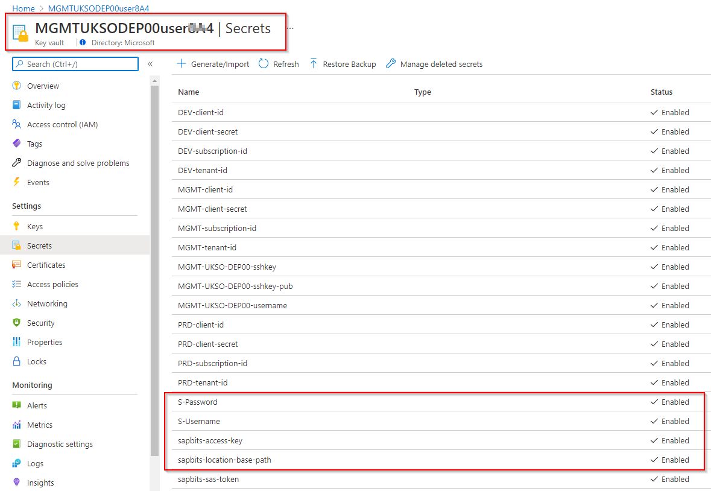

# Enterprise Scale for SAP Automation Framework Deployment

## Introduction

The SAP Automation Deployment Framework is an orchestration tool for deploying, installing and maintaining SAP environments. It can deploy the infrastructure as well as install the application. The automation lab is currently based on SAP HANA 1909. Below we will describe the general hierarchy and different phases of the deployment. There are several workflows to deploying the deployment automation, we will be focusing on one workflow for ease of deployment with a large audience.
## SAP deployment automation framework on Azure

The [SAP on Azure Deployment Automation Framework](https://github.com/Azure/sap-hana) is an open-source orchestration tool for
deploying, installing and maintaining SAP environments. You can create infrastructure for SAP landscapes based on SAP HANA and NetWeaver with AnyDB on any of the SAP-supported operating system versions and deploy them into any Azure region.

The [SAP on Azure Deployment Automation Framework](https://github.com/Azure/sap-hana) has two main components:
-	Deployment infrastructure (control plane) 
-	SAP Infrastructure (SAP Workload)

The dependency between the control plane and the application plane is illustrated in the diagram below


Diagram of dependency between the Control Plane and Application plane.


The framework uses [Terraform](https://www.terraform.io/) for infrastructure deployment, and [Ansible](https://www.ansible.com/) for the operating system and application configuration.

> [!NOTE]
> This automation framework is based on Microsoft best practices and principles for SAP on Azure. Review the [get-started guide for SAP on Azure virtual machines (Azure VMs)](get-started.md) to understand how to use certified virtual machines and storage solutions for stability, reliability, and performance.
> 
> This automation framework also follows the [Microsoft Cloud Adoption Framework for Azure](/azure/cloud-adoption-framework/).

You will use the control plane of the SAP Deployment Automation Framework to deploy the SAP Infrastructure and the SAP application infrastructure. The deployment uses Terraform templates to create the [infrastructure as a service (IaaS)](https://azure.microsoft.com/overview/what-is-iaas) defined infrastructure to host the SAP Applications.

The application configuration will be performed from the Ansible Controller in the Control plane using a set of pre-defined playbooks. These playbooks will:

- Configure base operating system settings
- Configure SAP-specific operating system settings
- Make the installation media available in the system
- Install the SAP system
- Install the SAP database (SAP HANA, AnyDB)
- Configure high availability (HA) using Pacemaker
- Configure high availability (HA) for your SAP database


## About the control plane

The control plane houses the infrastructure from which other environments will be deployed. Once the
control plane is deployed, it rarely needs to be redeployed, if ever.

The control plane provides the following services
-	Terraform Deployment Infrastructure
-	Ansible Controller
-	Persistent storage for the Terraform state files
-	Persistent storage for the Downloaded SAP Software
-	Secure storage for deployment credentials
-	Private DNS zone (optional)

The control plane is typically a regional resource deployed in to the hub subscription in a [hub and spoke architecture](/azure/architecture/reference-architectures/hybrid-networking/hub-spoke). 

The key components of the control plane are
- Deployment virtual machine 
- Storage account for Terraform state files
- Storage account for SAP installation media
- Keyvault for deployment credentials


## About the SAP Workload

The SAP Workload contains all the Azure infrastructure resources for the SAP Deployments. These resources are deployed from the control plane. 
The SAP Workload has two main components:
-	SAP Workload Zone
-	SAP System

## About the SAP Workload Zone

The workload zone allows for partitioning of the deployments into different environments (Development,
Test, Production)
The SAP Workload Zone provides the following services to the SAP Systems
-	Virtual Networking infrastructure
-	Secure storage for system credentials (Virtual Machines and SAP)
-	Shared Storage (optional)


## About the SAP System

The system deployment consists of the virtual machines that will be running the SAP application, including the web, app and database tiers.

The SAP System provides the following services
-	Virtual machine, storage, and supporting infrastructure to host the SAP applications.

## Glossary

The following terms are important concepts for understanding the automation framework.

### SAP components

| Term | Description |
| ---- | ----------- |
| System | An instance of an SAP application that contains the resources the application needs to run. Defined by a unique three-letter identifier, the **SID**.
| Landscape | A collection of systems in different environments within an SAP application. For example, SAP ERP Central Component (ECC), SAP customer relationship management (CRM), and SAP Business Warehouse (BW). |
| Workload zone | Partitions the SAP applications to environments, such as non-production and production environments or development, quality assurance, and production environments. Provides shared resources, such as virtual networks and key vault, to all systems within. |

The following diagram shows the relationships between SAP systems, workload zones (environments), and landscapes. In this example setup, the customer has three SAP landscapes: ECC, CRM, and BW. Each landscape contains three workload zones: production, quality assurance, and development. Each workload zone contains one or more systems.


Diagram of SAP configuration with landscapes, workflow zones, and systems.

### Deployment components

| Term | Description | Scope |
| ---- | ----------- | ----- |
| Deployer | A virtual machine that can execute Terraform and Ansible commands. Deployed to a virtual network, either new or existing, that is peered to the SAP virtual network. | Region |
| Library | Provides storage for the Terraform state files and SAP installation media. | Region |
| Workload zone | Contains the virtual network into which you deploy the SAP system or systems. Also contains a key vault that holds the credentials for the systems in the environment. | Workload zone |
| System | The deployment unit for the SAP application (SID). Contains virtual machines and supporting infrastructure artifacts, such as load balancers and availability sets. | Workload zone |

## Scenario 

For this lab, Contoso a large global customer wants to do SAP S/4HANA greenfield implementation on Azure. They must roll out the SAP solution quickly and ramp up the deployments in different azure region within a short time span. They also would like to ensure that running SAP workload on Azure platform follows Microsoft best practises and recommendations for SAP workload without compromising scalability and flexibility of cloud platform. Cloud centre of excellence team also wants to keep track of the infrastructure changes and configuration changes and adopt a deployment process which can scale globally without any drift.
You are working with Contoso to develop a process of implementing an automated deployment of single-node SAP S/4HANA system on Azure which they can use for rapid SAP landscape deployment.

**Here we will deploy an SAP S/4HANA standalone environment using bash. [Ensure that you have executed the pre-requisite tasks]**

Below is the estimated timelines to complete a standalone SAP S/4HANA installation with the automation framework

**Deployment timeline**

| Step | Action Plan | Execution Time |
| ---- | ----------- | ----- |
| 1 | Introduction and Session Walkthrough | 10 minutes |
| 2 | Repository Overview | 5 minutes |
| 3 | Management Zone Deployment/Control Plane Deployment (Deployer and Library)| 20-25 minutes |
| 4 | SAP Software Download / BoM Processing | 120 - 130 minutes |
| 5 | Workload Zone Deployment | 10-15 minutes |
| 6 | SAP System Deployment | 15-20 minutes |
| 7 | SAP System Installation (Ansible Execution) | 80-90 minutes |
| 8 | Deployment CleanUp | 30 minutes |

## Pre-Requisties Steps (Task 0-5)

For this workshop we will be using the Cloud Shell in the portal to deploy the Control Plane infrastructure. Then, we will be using the Deployer VM to deploy the remaining deployment steps. We will be using **sap-level-up** branch for our lab setup.

***Task 0: Repository, Downloads and Tooling***

The GitHub repository can be found at the link below:

[Azure/sap-hana: Tools to create, monitor and maintain SAP landscapes in Azure. (github.com)](https://github.com/Azure/sap-hana)

Be sure to change the branch from master to **sap-level-up**:


We strongly recommend familiarizing yourself with the documentation ahead of time to get an idea of how the SAP Automation Framework works.

You will need an SSH client in order to connect to the Deployer. We recommend using [**Putty**](https://www.chiark.greenend.org.uk/~sgtatham/putty/latest.html). You can also use any other SSH client that you feel comfortable with.

***Review the Azure Subscription Quota***

    As part of SAP Level Up lab setup, please ensure that your subscription has a minimum of 50 vCPU quota for each compute sku DDSV4 & EDSV4 in the targeted region.

| Region Name | Region Code | 
| ---- | ----------- |
| Australia East | AUEA |
| Canada Central | CACE |
| Central US | CEUS |
| Est US | EAUS |
| North Europe | NOEU |
| South Africa North | SANO |
| South East Asia | SOEA |
| UK South | UKSO |
| West Europe | WEEU |
| West US 2 | WES2 |

***Task 1: Cloud Shell Setup***

-   Go to Azure Cloud Shell
    (<https://ms.portal.azure.com/#cloudshell/>)
-   Run the following commands:

1. [Sign in to the Azure CLI](/cli/azure/authenticate-azure-cli) with the account you want to use.

    ```azurecli-interactive
    az login
    ```
    Follow the instructions displayed in order to authenticate. You should see the following screen upon successful authentication
    
Follow the instructions displayed in order to authenticate. You should see the following screen upon successful authentication:
    

2. Set the right subscription you want to use for this deployment.

    ```azurecli-interactive
     az account set -s <your subscription ID>
    ```
3. view your subscriptions [get the subscription ID] you wish to use.

    ```azurecli-interactive
     az account list -o table | grep True
    ```
4. Create Azure_SAP_Automated_Deployment Directory.

    ```azurecli-interactive
     mkdir Azure_SAP_Automated_Deployment
    ```
5. Clone the hana repository with sap-level-up branch.

    ```azurecli-interactive
     cd Azure_SAP_Automated_Deployment
     git clone https://github.com/Azure/sap-hana.git --branch=sap-level-up
    ```
6. Check the hana repository status. Make sure your local branch is up to dated otherwise issue git pull.

    ```azurecli-interactive
     cd sap-hana
     git status
     git pull
    ```
    

7. Check terraform, ansible and jq version of your cloud shell environment.

    ```azurecli-interactive
     cd sap-hana/util
     ./check_workstation.sh
    ```
   

-   Below are the minimum supported software versions you need to have for the automation framework to work:
    ```azurecli-interactive
     az = 2.28.0
     terraform = 0.14.7
     ansible = 2.10.2
     jq = 1.5
    ```
    If you do not have at least version 0.14.7 for Terraform, please upgrade
using the instructions
[here](https://docs.microsoft.com/en-us/azure/developer/terraform/get-started-cloud-shell-bash?tabs=bash#3-install-latest-version-of-terraform-in-azure-cloud-shell)

***Task 2: SPN Creation***

    Per Microsoft security guidelines, there will be no screenshots of this task.

-   The Automation Framework requires the creation of an SPN. Please
    create one in the Cloud Shell using the following commands:

    When choosing the name for your service principal, ensure that the name is unique within your Azure tenant
    ```azurecli-interactive
    az ad sp create-for-rbac --role="Contributor" --scopes="/subscriptions/<Your subscription ID>" --name="SAP-Deployment-<Your Name>"
    ```
-   After running this command, you will have output that is populated
    with actual values, like the following:
    ```azurecli-interactive
    appId: <AppID>
    displayName: SAP-Deployment-[YourName]
    name: <AppID>
    password: <AppID Secret>
    tenant: <Tenant ID>
    ```
-   Copy the details to a notepad/similar as these details are key for
    the next steps. The pertinent fields are**:**

    -   **appId**

    -   **password**

    -   **Tenant**
    
    For your reference, here is the mapping between the output above and the parameters that you will need to populate later for the automation commands

    | Parameter Input name | Output from above | 
    | ---- | ----------- |
    | spn_id | appId |
    | spn_secret | password |
     tenant_id | tenant |
-   Finally, assign the "User Access Administrator" role to the SPN by
    running the following command:
     ```azurecli-interactive
    az role assignment create --assignee <appId> --role "User Access Administrator"
    ```

***Task 3: View Configuration Files and Collect Parameter Values***

    Note that you may have to type this command manually or paste to another file editor rather than copy/paste directly into the Azure Cloud Shell terminal from this document. Each parameter for the automation commands will begin with a double dash ("\--"). Ensure that there are no special characters when typing/pasting in the commands

-   In the Cloud Shell, type the following commands:
     ```azurecli-interactive
    cd ~/Azure_SAP_Automated_Deployment Administrator"
    cp -Rp ./sap-hana/deploy/samples/WORKSPACES ./
    ```
    Please run "ls" and verify that WORKSPACES folder is available
    

    Issue the below command.Please note that there is a period at the end of the command:
     ```azurecli-interactive
    code .
    ```
    

-   Expand the **WORKSPACES** directory -- you will see 5 sub folders:
    **DEPLOYER**, **LANDSCAPE**, **LIBRARY**, **SYSTEM** and **BOMS.**
    Expand each of these folders to find regional deployment
    configuration files similar to the below screenshot:

    
    
    Use the same regional folder for Deployer, Library and Worklload with regards to your target azure region deployment.

-   We have mapped different Azure region with 4-character code (Upper
    Case) and subsequent folders inside WORKSPACES folder has been
    created to represent deployment in those respective regions. Please
    find the below table for reference
    | Region Name | Region Code | 
    | ---- | ----------- |
    | Australia East | AUEA |
    | Canada Central | CACE |
    | Central US | CEUS |
    | Est US | EAUS |
    | North Europe | NOEU |
    | South Africa North | SANO |
    | South East Asia | SOEA |
    | UK South | UKSO |
    | West Europe | WEEU |
    | West US 2 | WES2 |

-   If you drill down into each regional sub folder, you will see the
    Terraform variable files that are used for configuration. Snippet of
    the **DEPLOYER** Terraform variable file below.
    

-   There are no edits necessary for the Terraform variable files --
    this is informational only so that you can view them and know where
    to make edits for future deployments.

***Task 4: Export variables and run the prepare_region.sh script***

1.  We will use the **prepare_region** script in order to deploy the
    Deployer and Library. These deployment piece makes up the
    "Automation Region"
     ```azurecli-interactive
    az login
    ```
    Follow the instructions in the Cloud Shell for authenticating with device code and with your normal account, not the service principal you created earlier.
2.  Set the right subscription you want to use for this deployment.

    ```azurecli-interactive
     az account set -s <your subscription ID>
    ```
3.  Export environment variables
    ```azurecli-interactive
     export DEPLOYMENT_REPO_PATH=~/Azure_SAP_Automated_Deployment/sap-hana/
     export ARM_SUBSCRIPTION_ID=<YOUR SUBSCRIPTION ID>
    ```
     
    Empty output means it has executed as expected. Proceed to next steps

4.  Navigate to the **WORKSPACES** folder and deploy the Automation
    Region and run the following commands:
    ```azurecli-interactive
     cd ~/Azure_SAP_Automated_Deployment/WORKSPACES
     ${DEPLOYMENT_REPO_PATH}/deploy/scripts/prepare_region.sh \
        --deployer_parameter_file DEPLOYER/MGMT-WEEU-DEP00-INFRASTRUCTURE/MGMT-WEEU-DEP00-INFRASTRUCTURE.tfvars \
        --library_parameter_file LIBRARY/MGMT-WEEU-SAP_LIBRARY/MGMT-WEEU-SAP_LIBRARY.tfvars \
        --subscription <subscription ID> --spn_id <App ID> --spn_secret <SPN password> --tenant_id <tenant ID> --auto-approve
    ```
    The Automation will run the Terraform Initialize and Plan operations.

    

    This deployment may run between 15 and 20 min. You should be able to see the progress of the deployment as below:

    

    The deployment will go through cycles of deploying the infrastructure, refreshing the state, and uploading the Terraform state files to the Library storage account
    If you get the following error for the Deployer deployment, this is transient, and you can simply rerun the exact same command.
    
    
    If you run into authentication issues directly after running the prepare_region script, please execute the below commands
    ```azurecli-interactive
     az logout
     az login
    ```
    Also please ensure you are using the correct subscription, the one where you created the SPN. If you execute az logout, then you must export your session variables again.

-   When the entire deployment is complete and you will see deployment successful message in your terminal, then go to the Azure portal and verify the resources    inside the Deployer Infrastructure Resourcegroup **(MGMT-\<region>-DEP00-INFRASTRUCTURE)** . You should see the following resources are deployed.
    
    Deployer Infrastructure resource group:
    
    LIBRARY resource group (**MGMT-\<region>-SAP_LIBRARY**)
    
    Inside the state file storage account and inside the tfstate container, you should see the Deployer and Library state files:
    

-   Collect the following information in a text editor of your choice.
    We will use these details as parameter inputs for the remainder of
    the commands in Module One:

    -   The name of the Terraform state file storage account in the
        Library resource group. Deployer resource group -\> state
        storage account \> containers -\> tfstate -\> Copy the **name**
        of the Deployer state file

    
    

-   The private ssh secret for the Deployer VM.

    Deployer Resource Group -\> **MGMT\<region>DEP00userXXX -\> \<KeyVault> -\>** Click on Secret -\> Click on current version -\> Copy the secret

    
    
    
    
    Open Notepad or a similar editor and paste the contents of the secret value. We will use it in the next step.

-   The name of the Deployer resource group key vault
    

-   The Public IP address of the Deployer VM
    Deployer resource group -\> Deployer VM -\> copy Public IP Address

    

***Task 5: Connect to the Deployer - The rest of Module One will be completed on the Deployer VM***
    
    Ensure that you can connect to your deployer VM as we will be deploying the rest of the infrastructures from that machine. If you need assistance, please reach out to your coach

-   Open Notepad or and editor of your choice and copy the ssh key collected in the previous task. Copy the file to "C:\\Users\\\[youralias\]\\.ssh. Name the file "deployer_ssh" and save as the type
    "All Files"
    

    Make sure that file name should not have .txt extension
    
    

-   Open PuttyGen (do this by opening a command window and typing
    *puttygen.exe*), then click on "Load"

    

-   *Load the SSH key*

    

-   Save the private the key with name **\<Region>-deployer_ssh**

    

-   **Connecting the Deployer VM using PuTTY:**
-   Open Putty

-   Host Name: azureadm@\<Deployer Public IP Address>

-   Connection Name in Saved Sessions:
    > MGMT-**\<Region>**-SSHConnectivity"

    

-   In the Navigation bar expand "SSH" \--\> Auth setting and add the path to the SSH key file browse to "C:\\Users\\\[youralias\]\\.ssh\\\<Region>-deployer.ppk" saved

    

-   Click on Open to open the connection to the Deployer:

    

    

**This completes the control plane deployment of the lab. Perform the remaining tasks in Module One on the Deployer VM**

***Task 6: Get the WORKSPACES folder and set the branch***

-   Navigate to the **\~/Azure_SAP_Automated_Deployment** folder and remove the existing WORKSPACES folder.
    ```azurecli-interactive
     cd  ~/Azure_SAP_Automated_Deployment
     rm -Rf WORKSPACES
    ```
-   Checkout the sap-level-up branch and copy the workspaces folder

    ```azurecli-interactive
     cd  sap-hana
     git checkout sap-level-up
    ```    

    

-   Go back to the root deployment folder and copy the repository WORKSPACES folder

    ```azurecli-interactive
     cd ~/Azure_SAP_Automated_Deployment
     cp -Rp ./sap-hana/deploy/samples/WORKSPACES ./
    ``` 
    


***Task 7: BOM Details***

The Automation Framework gives you tools to download the SAP Bill Of Materials (BOM). The downloaded files will be stored in the sapbits storage account in the SAP Library. The idea is that the sap library will act as the archive for all sap media required for your SAP implementation project.
The BOM itself mimics the SAP maintenance planner in that we have the relevant product ids and the package download URLs. Once the BOM is processed, during SAP system configuration the Deployer reads the BOM and downloads files from the storage account to the SCS Server for Installation.


### Download SAP software

You need a copy of the SAP software before you can use [the deployment automation framework](automation-deployment-framework.md). [Prepare your Azure environment](#configure-key-vault) so you can put the SAP media in your storage account. Then, [download the SAP software using Ansible playbooks](#download-sap-software).

### Prerequisites

- An Azure subscription. If you don't have an Azure subscription, you can [create a free account](https://azure.microsoft.com/free/?WT.mc_id=A261C142F).
- An SAP user account (SAP-User or S-User account) with software download privileges.

### Configure key vault

First, configure your deployer key vault secrets. For this example configuration, the resource group is `DEMO-EUS2-DEP00-INFRASTRUCTURE` or `DEMO-SCUS-DEP00-INFRASTRUCTURE`.

1. [Sign in to the Azure CLI](/cli/azure/authenticate-azure-cli) with the account you want to use.

    ```azurecli-interactive
    az login
    ```

2. Add a secret with the username for your SAP user account. Replace `<keyvault-name>` with the name of your deployer key vault. Also replace `<sap-username>` with your SAP username.

    ```azurecli-interactive
     az keyvault secret set --name "S-Username" --vault-name "<keyvault-name>" --value "<sap-username>";
    ```

3. Add a secret with the password for your SAP user account. Replace `<keyvault-name>` with the name of your deployer key vault. Also replace `<sap-password>` with your SAP password.

    ```azurecli-interactive
    az keyvault secret set --name "S-Password" --vault-name "<keyvault-name>" --value "<sap-password>";
    ```

4. There are two other secrets which are needed in this step for the storage account `sapbits`, are automatically setup by the automation framework. However its always good to verify whether these are existed in your deployer keyvault or not

    ```azurecli-interactive
    sapbits-access-key
    sapbits-location-base-path
    ```

    

### Download SAP software

Next, [configure your SAP parameters file](#configure-parameters-file) for the download process. Then, [download the SAP software using Ansible playbooks](#download-sap-software). 

***Configure parameters file***

1. Navigate to the SAP deployment workspace's directory.

    ```azurecli-interactive
    cd ~/Azure_SAP_Automated_Deployment/WORKSPACES/
    ```

2. Create a new directory called `BOMS`:

    ```azurecli-interactive
    mkdir -p ~/Azure_SAP_Automated_Deployment/WORKSPACES/BOMS; cd $_
    ```

3. Create the SAP parameters YAML file.

    ```azurecli-interactive
    cat <<EOF > sap-parameters.yaml
    ---
    bom_base_name:               S41909SPS03_v0005ms
    sapbits_location_base_path:  https://<storage_account_FQDN>/sapbits
    kv_name:
    secret_prefix:                   
    ...
    EOF
    ```

4. Open `sap-parameters.yaml` in an editor.

    ```azurecli-interactive
    vi sap-parameters.yaml
    ``` 

5. Update the following parameters:

    1. Change the value of `bom_base_name` to `S41909SPS03_v0005ms`.

    2. Change the value of `sapbits_location_base_path` to the path to your storage account `sapbits`.

    3. Change the value of `kv_name` to the name of the deployer key vault (Control Place).

    4. Change the value of `secret_prefix` to S

    

### Execute Ansible playbooks

Now, execute the Ansible playbooks. One way you can execute the playbooks is to use the validator test menu:

1. Run the validator test menu script:

    ```azurecli-interactive
    ~/Azure_SAP_Automated_Deployment/sap-hana/deploy/ansible/validator_test_menu.sh
    ```

1. Select which playbook to execute. For example:
    
    ```output
    1) BoM Downloader
    2) BoM Uploader
    3) Quit
    Please select playbook: 
    ```

1. Repeat for other playbooks you want to execute.

Another option is to execute the Ansible playbooks using the command `ansible-playbook`. You can execute the SAP BoM uploader and downloader in either separate commands or the same command.

```azurecli-interactive
ansible-playbook                                                                                   \
  --user        azureadm                                                                           \
  --private-key sshkey                                                                             \
  --extra-vars="@sap-parameters.yaml"                                                              \
  ~/Azure_SAP_Automated_Deployment/sap-hana/deploy/ansible/playbook_bom_downloader.yaml            \
  ~/Azure_SAP_Automated_Deployment/sap-hana/deploy/ansible/playbook_bom_uploader.yaml              
```

### BoM Templete Sample

    The BOM itself mimics the SAP maintenance planner in that we have the relevant product ids and the package download URLs. Once the BOM is
    processed, during SAP system configuration the Deployer reads the BOM and downloads files from the storage account to the SCS Server for Installation.

A sample extract of a BOM file is provided below
    


## **Task 8: Deploy the Workload Zone**

-   On the Deployer VM, navigate directly to the regional Workload zone
    folder:

> **cd
> \~/Azure_SAP_Automated_Deployment/WORKSPACES/LANDSCAPE/DEV-\<region>-SAP01-INFRASTRUCTURE**

-   Run the following command. Replace all parameters with the
    appropariate details that you have collected in previous Tasks:

> **\${DEPLOYMENT_REPO_PATH}/deploy/scripts/install_workloadzone.sh
> \--parameterfile ./DEV-\<region>-SAP01-INFRASTRUCTURE.tfvars
> \--deployer_environment MGMT \--subscription \<subscription ID>
> \--spn_id \<SPN App ID> \--spn_secret \<SPN Secret> \--tenant_id
> \<Tenant ID> \--state_subscription \<subscription ID> \--vault
> \<DEPLOYER resource group key vault> \--storageaccountname \<state
> file storage account name> \--deployer_tfstate_key \<name of the
> deployer state file> \--auto-approve**
>
> 

-   You should start to see the landscape module deploy:

> 

Similarly, once the Landscape is complete, you can deploy the system
resources using the following commands:

-   **cd
    \~/Azure_SAP_Automated_Deployment/WORKSPACES/SYSTEM/DEV-\<region>-SAP01-X00**

```{=html}
<!-- -->
```
-   **\${DEPLOYMENT_REPO_PATH}/deploy/scripts/installer.sh
    \--parameterfile DEV-\<region>-SAP01-X00.tfvars \--type sap_system
    \--auto-approve**

-   You should have two more resource groups

```{=html}
<!-- -->
```
-   Landscape Resource Group example:

> 

-   System Resource Group (Abridged):\
    

## **Task 9: Naming Conventions**

-   Please see the information on changing the naming convention
    [here](https://github.com/jhajduk-microsoft/sap-hana/blob/master/documentation/SAP_Automation_on_Azure/Process_Documentation/Changing_the_naming_convention.md)

-   Please see the video on naming conventions
    [here](https://microsoft.sharepoint.com/:v:/t/NorthStarPlaybookWorkshop/EfdM1eCJga1OkJXXB5d6lDQBzNzXiU7BZkoQjC6bp325Wg)

Give the break for 10 min and talk about naming convention

## **Task 10: SAP Installation**

For a standalone SAP S/4HANA system we have 8 playbooks to execute in
sequence.

> OS Config
>
> SAP Specific OS Config
>
> BoM processing
>
> HANA DB Install
>
> SCS Install
>
> DB Load
>
> PAS Install
>
> APP Install (Optional)

You need to make sure you have two files generated from earlier SAP
infrastructure provisioning and they are available at
SYSTEM\\DEV-\<region>-SAP01-X00. 

1.  sap-parameters.yaml

2.  X00host.yaml

-   In the sap-parameters.yaml you have to fill bom_base_name parameter
    and modify secret_prefix as below

```{=html}
<!-- -->
```
-   Bom_base_name: S41909SPS03_v0005ms

-   ## kv_name: Name of DEV-\<region>-SAP-INFRASTRUCTURE resource group´s key vault e.g., DEVUKSOSAPuser432** **

-   secret_prefix: DEV-\<region>-SAP (\"region" is four-character region
    code for your deployment). This value is perhaps already populated
    as DEV-\<region>-SAP01; this means remove the "01" at the end.

```{=html}
<!-- -->
```
-   You also have to set the value for sap_fqdn; something like
    foo.sap.com will work fine.

In case you see error like this --


To fix this error, add your Azure user to access policy of key vault in
DEV-\<region>-SAP-INFRASTRUCTURE.

With this, you should be ready to execute the steps 10-1 to 10-8.

Now execute the **\${DEPLOYMENT_REPO_PATH}/deploy/ansible/test_menu.sh**
script

#### **10-1: OS Config**


At the end you will see the screen like below


#### **10-2: SAP** Specific OS config


#### **10-3: BoM** Processing


#### **10-4: HANA DB Install**

Before you install HANA please check the secret
DEV-WEEU-SAP-\<SID>-sap-password inside workload keyvault have the value
not starting with a digit


So, if the value looks like above i.e starting with a number, we need to
change it.

The password of user DBUser may only consist of alphanumeric characters
and the special characters #, \$, @ and \_. The first character must not
be a digit or an underscore

So it will look like below


#### **10-5: SCS Install**


#### **10-6: DB Load**


#### **10-7: PAS** Install


#### **10-8: APP Install**


Congratulations! You have reached the end of Module One and have
deployed a stand-alone S/4HANA system.

#### **10-9: SAP System Verification**

Now we need to verify the system we have just installed. Please follow
the below steps to check the system status.

Connecting to the corresponding SAP VMs

We can connect to all SAP VMs from deployer VM through SSH. sshkey key
will be available at SYSTEM\\DEV-\<region>-SAP01-X00 folder

**Note:** If you didn't find the sshkey in the above-mentioned folder
then you can copy it from secret DEV-XXXX-SAP-sid-sshkey inside
DEVXXXXSAPuserxxx keyvault.

[Checking HANA services]{.underline}

Login to HANA VM

ssh -i sshkey azureadm@\< DEV-XXXX-SAP01-X00_x00dhdb00l0xxx
\_vm_private_ip>

sudo su - hdbadm

sapcontrol -nr 00 -function GetProcessList


All the services status should be green

*Note: 00 here is the instance number of HANA DB*

[Checking SCS Instance]{.underline}

ssh -i sshkey azureadm@\< DEV-XXXX-SAP01-X00_x00scs00lxxx
\_vm_private_ip>

sudo su -- x00adm

sapcontrol -nr 00 -function GetProcessList


All the services status should be green

*Note: 00 here is the instance number of SCS Instance*

[Checking PAS Instance]{.underline}

ssh -i sshkey azureadm@\< DEV-XXXX-SAP01-X00_x00app00lxxx_vm_private_ip>

sudo su -- x00adm

sapcontrol -nr 00 -function GetProcessList


All the services status should be green

*Note: 00 here is the instance number of PAS Instance*

[Checking Additional Application Instance]{.underline}

ssh -i sshkey azureadm@\< DEV-XXXX-SAP01-X00_x00app01lxxx_vm_private_ip>

sudo su -- x00adm

sapcontrol -nr 00 -function GetProcessList


All the services status should be green

*Note: 00 here is the instance number of AAS Instance*

## **Task 11: Clean-up**

You may perform this task outside of the lab but please be sure to do so
as the **[infrastructure can be quite expensive so do not
delay!]{.underline}** You may find that you lose any credits you have
very quickly. Follow the below steps in sequence to remove the entire
SAP infrastructure you have deployed earlier:

Remove SAP Infra Resources -\> Remove Workload Zone -\> Remove Control
Plane

Please also note that

1.  Removal of SAP infra-Resources

2.  Removal of workload Zone

Should be executed from the deployer VM, whereas

3.  Removal of control Plane

Should be executed from cloud shell where you have deployed the control
plane earlier

So, let's start cleaning up Azure resources (for 1 and 2 as mentioned
above) from your Deployer VM

Before you start executing remover script make sure you have logged in
to your Azure account by executing the below command

az login

Authenticate through
<https://login.microsoftonline.com/common/oauth2/authorize>

and enter your device code you see in the bash shell

If you notice multiple subscriptions, please set the specific
subscription you are working with by executing the below command

az account set \--subscription \<your subscription ID>

**Removal of SAP infra resources**

-   Navigate to the DEV-XXXX-SAP01-X00 subfolder inside SYSTEM folder
    and execute the below command from there

> **\$DEPLOYMENT_REPO_PATH/deploy/scripts/remover.sh \--parameterfile
> DEV-\<region>-SAP01-X00.tfvars \--type sap_system**
>
> Proceed with **'yes'**

**Removal of SAP workload resources**

-   Navigate to the DEV-XXXX-SAP01-INFRASTRUCTURE sub-folder inside
    LANDSCAPE folder and execute the below command from there

> **\$DEPLOYMENT_REPO_PATH/deploy/scripts/remover.sh \--parameterfile**
> **DEV-\<region>-SAP01-INFRASTRUCTURE.tfvars \--type sap_landscape**
>
> Proceed with **'yes'**

**Removal of Control Plane**

-   Now go to <https://shell.azure.com> (for 3)

-   Navigate to the WORKSPACES folder inside
    \~/Azure_SAP_Automation_Deployment folder

-   Export the below two environment variables (It get lost after
    session time out)

> **export
> DEPLOYMENT_REPO_PATH=\~/Azure_SAP_Automated_Deployment/sap-hana**
>
> **export ARM_SUBSCRIPTION_ID=\<Your Subscription ID>**

-   and run the below command from WORKSPACES folder:

> **\$DEPLOYMENT_REPO_PATH/deploy/scripts/remove_region.sh
> \--deployer_parameter_file DEPLOYER/MGMT-\<region>-DEP00-**
> **INFRASTRUCTURE/MGMT-\<region>-DEP00-INFRASTRUCTURE.tfvars --**
> **library_parameter_file LIBRARY/MGMT-\<region>-SAP_LIBRARY/
> MGMT-\<region>-SAP_LIBRARY.tfvars**
>
> Proceed with **'yes'**
>
> **Please verify in the Azure portal that all the resource groups are
> now deleted -- if not, delete any remaining resource groups
> manually.**

# Congratulation! You have cleaned up all resources. 

#