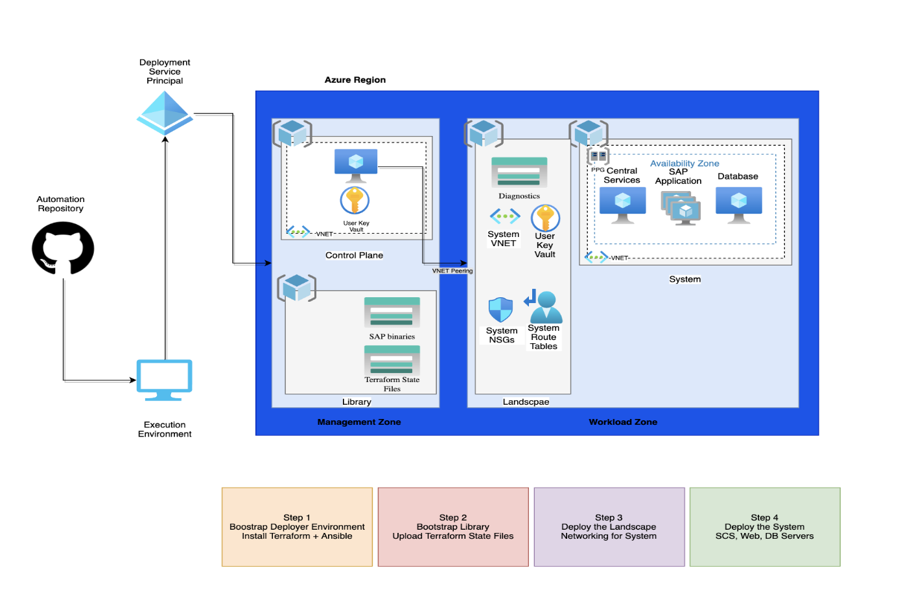
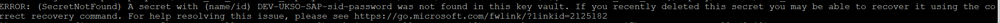

**Module 1: Enterprise Scale for SAP Automation Framework Deployment**

## Scenario 

For this workshop we will be using the Cloud Shell in the portal to
deploy the Control Plane infrastructure. Then, we will be using the
Deployer VM to deploy the remaining infrastructure and the SAP HANA
configurations. There is a customized branch based on the Automation
Framework that will enable us to follow this scenario. This is the
**sap-level-up** branch.

## Introduction

The SAP Automation Deployment Framework is an orchestration tool for
deploying, installing and maintaining SAP environments. It can deploy
the infrastructure as well as install the application. The automation
lab is currently based on SAP HANA 1909. Below we will describe the
general hierarchy and different phases of the deployment. There are
several workflows to deploying the deployment automation, we will be
focusing on one workflow for ease of deployment with a large audience:
**a SAP-HANA standalone environment deployed using bash. [Ensure that
you execute the pre-requisite tasks]{.underline}**

**Environment Overview**



**[Management Zone:]{.underline}** The management zone houses the
infrastructure from which other environments will be deployed. Once the
management zone is deployed, it rarely needs to be redeployed, if ever.

**Deployer**

This deployment houses the infrastructure that will be needed to deploy
the rest of the infrastructure. It contains the deployer VM, network
infrastructure on which it lives and a key vault with secrets. Deployer
VM has Ansible and Terraform installed and is used to deploy the
remaining Landscape Zone and Workload Zone. A copy of the repository
that you used to deploy the Control Plane will be transferred to the
Deployer machine

**Library**

This deployment consists of the storage accounts for the Terraform state
files as well as the storage account for the SAP bits that will be
deployed to the System deployment.

**[Workload Zone]{.underline}**: The Workload Zone contains the VMs for
the SAP application, including Web VMs, Central Services VMs, and the
HANA database machines. It also deploys the requisite infrastructure
such as the virtual network and the NSGs/Route Table.

**Landscape**

The Landscape contains the Networking for the SAP VMs, including Route
Tables, NSGs, and Virtual Network. The Landscape provides the
opportunity to divide deployments into different environments (Dev,
Test, Prod)

**System**

The system deployment consists of the virtual machines that will be
running the SAP application, including the web, app and database tiers.

  -----------------------------------------------------------------------------------------
  **Step**   **Action Plan**                                **Installation   **Time
                                                            time**           required for
                                                                             each step**
  ---------- ---------------------------------------------- ---------------- --------------
  1          Introduction and Session Walkthrough           NA               10 min

  2          Repository Overview                            NA               5 min

  3          Management Zone Deployment Overview (Deployer  15-30 mins       Prerequisite
             and Library)                                                    

  4          Deploy the Workload Zone Walkthrough           15-30 mins       

  5          System Deployment                               20-30 mins      

  6          Break                                          10 mins          

  7          Talk about naming conventions                  20 mins          

  8          SAP Installation                               60 mins          

  9          SAP Installation Cleanup\[To save the          30 mins          
             credits\]                                                       

                                                                             

                                                                             

                                                                             

                                                                             

                                                                             

                                                                             
  -----------------------------------------------------------------------------------------

# Tasks 0 -- 5 are PRE-REQUISITES to the Level Up

## Task 0: Repository, Downloads and Tooling

The GitHub repository can be found at the link below:

[Azure/sap-hana: Tools to create, monitor and maintain SAP landscapes in
Azure. (github.com)](https://github.com/Azure/sap-hana)'''

Be sure to change the branch from master to **sap-level-up**:


We strongly recommend familiarizing yourself with the documentation
ahead of time to get an idea of how the SAP Automation Framework works.

You will need an SSH client in order to connect to the Deployer. We
recommend using
[**Putty**](https://www.chiark.greenend.org.uk/~sgtatham/putty/latest.html).
Use any SSH client that you feel comfortable with.

Review the Azure Subscription Quota

As part of SAP Level Up, please ensure Microsoft Subscription has a
sufficient Quota of a minimum of 50 for compute sku DDSV4 & EDSV4 in the
assigned region.

  -----------------------------------------------------------------------
  Region Name                                    Region Code
  ---------------------------------------------- ------------------------
  Australia East                                 AUEA

  Canada Central                                 CACE

  Central US                                     CEUS

  East US                                        EAUS

  North Europe                                   NOEU

  South Africa North                             SANO

  Southeast Asia                                 SOEA

  UK South                                       UKSO

  West Europe                                    WEEU

  West US 2                                      WES2
  -----------------------------------------------------------------------

**Let us begin the pre-requisite portion of the lab**

## **Task 1: Cloud Shell Setup**

-   Go to **shell.cloud.com
    (<https://ms.portal.azure.com/#cloudshell/>)**

```{=html}
<!-- -->
```
-   Run the following commands:

> **az login**

Follow the instructions displayed in order to authenticate. You should
see the following screen upon successful authentication:


> **az account set -s \<your subscription ID>**
>
> **az account list -o table \| grep True**
>
> Above command helps you to view your subscriptions and [get the
> subscription ID]{.underline} of the one you wish to use.
>
> **mkdir Azure_SAP_Automated_Deployment**
>
> **cd Azure_SAP_Automated_Deployment**
>
> **git clone <https://github.com/Azure/sap-hana.git>**
>
> **cd sap-hana**
>
> **git checkout sap-level-up (ONLY work from this branch during the
> lab)**
>
> 
>
> cd util
>
> Execute the command **./check_workstation.sh**
>
> 

-   The below versions are supported for the automation:

> **az = 2.28.0**
>
> **terraform = 1.0.8**
>
> **ansible = 2.10.2**
>
> **jq = 1.5**

If you do not have at least version 0.14.7 for Terraform, please upgrade
using the instructions
[here](https://staticsint.teams.cdn.office.net/evergreen-assets/safelinks/1/atp-safelinks.html?url=https%3A%2F%2Fdocs.microsoft.com%2Fen-us%2Fazure%2Fdeveloper%2Fterraform%2Fget-started-cloud-shell-bash%3Ftabs%3Dbash%233-install-latest-version-of-terraform-in-azure-cloud-shell&locale=en-us&dest=https%3A%2F%2Fteams.microsoft.com%2Fapi%2Fmt%2Fpart%2Fmsft%2Fbeta%2Fatpsafelinks%2Fgeturlreputationsitev2%2F&pc=h5IGXkXPK4uYjva%252foinlhdhyiJfAq1znA%252bGUn4pcjY21Vux%252buUncbgcXJcwiPk77Ib1no%252f0lL1%252beHGFWqMLlI%252bkCwByWZaeZwjm%252fegaAQ5HOXRc5KV2YHXr5D%252fM0Sgjze61HICKwkTPR%252b6p5Lfi8uQO9zE1kMiJp2ekSpqSRlohbmUUX9fk5SGcxRbiUIiD0IiQZ69h%252f3H4nBhww%252fTKaO%252bjljQqBGX96OWQaz5kBv1ZLNruKlicFNKSWVeDJEiQnADTqzafrYyIM%252bjyrlfN4xB3bxULqKN7OhU9vQUgID0YCYYs%252bWI8rpyLviLB2IpMnaWnau4apDScz1n%252fANYdb%252fis5YHvbxDZwQEWL%252b3Rx1sxJk%252fvACR66%252bposC0bMtyHZ55Fv8C6iAceR5kQfasVxcgB5UyLzt2PIo8D4%252fR9fuvdqz9sEH7uFKqUHDkVsWjUuImNUD5PXPlYa619iDChUpM3rvbYuYA87WD7fTNgI8df3MUDqnAWp4n7ITQCV5O6OE0fdhWtBVc4tzRIO1IJVsNo2YDrAoByPNUPNybivCZFE%252fcYWcXWDWYS14XY0EGTIOdjpEU915FWby2ZaAFp28WjIvXA%252bIqoINemcQegLVFK55PH3L7J61qdxlse5IVidfVuYrnc%252bPib4V4BZXH3ki3oFD9Llk1XAO3hLbBN6OtJozDrkdyfrh4qP9WSNUt1eLcMrYMzh94VhPLhe%252b326Yv2xfY8uvFk8%252b%252bzSL%252b5jrTmqPRKLa2Ej1KkKrmpsSnXzGD%252f%252bQHZaKI6mU7tVlNh5hTUKLiuqbD8tmkL2up2GiAaNq3uI9XEO%252fcYmzw50TzUFK4RQ%252frBhKN%252bCtHzYUxchUj%252bHt0SXNX89N8Mrm01idoUpmqv8lPc9qez1aBuv9OjNZAD5pA6a5jceqfKEqqoFNA%253d%253d%3B%20expires%3DFri%2C%2022%20Oct%202021%2021%3A10%3A05%20GMT%3B%20path%3D%2F&wau=https%3A%2F%2Fnam06.safelinks.protection.outlook.com%2FGetUrlReputation&si=https%3A%2F%2Fteams.microsoft.com%2Fmulti-window%2F%3Fagent%3Delectron%26version%3D21092203715&sd=%7BconvId%3A%2019%3Ameeting_Zjg5MzI0YzctYTUwNS00NDgzLWFmYTQtN2ExNGQyM2JhNTcw%40thread.v2%2C%20messageId%3A%201634918084953%7D&ce=prod&cv=27%2F21092203715&ssid=32689ba9-8f5b-2d87-0876-1dcc93b67a72&ring=ring3_9)

## **Task 2: SPN Creation**

**Per Microsoft security guidelines, there will be no screenshots of
this task. Ask your proctor for help if you need assistance with the
following.**

-   The Automation Framework requires the creation of an SPN. Please
    create one in the Cloud Shell using the following commands:

> **When choosing the name for your service principal, ensure that the
> name is [unique within your Azure tenant]{.underline}**
>
> **az ad sp create-for-rbac \--role=\"Contributor\"
> \--scopes=\"/subscriptions/\<Your subscription ID>\"
> \--name=\"LevelUP-SAP-Deployment-\<Your alias>\"**

-   After running this command, you will have output that is populated
    with actual values, like the following:

> **{**
>
> **\"appId\": \"\<AppID>\",**
>
> **\"displayName\": \" \[Yourname\]-Deployment-Account \",**
>
> **\"name\": \"\<AppID>,**
>
> **\"password\": \"\<AppID Secret>\",**
>
> **\"tenant\": \"\<Tenant ID>\"**
>
> **}**

-   Copy the details to a notepad/similar as these details are key for
    the next steps. The pertinent fields are**:**

    -   **appId**

    -   **password**

    -   **Tenant**

> **For your reference, here is the mapping between the output above and
> the parameters that you will need to populate later for the automation
> commands:**

  -----------------------------------------------------------------------
  **Parameter Input name**            **Output from above**
  ----------------------------------- -----------------------------------
  **spn_id**                          **"appId\"**

  **spn_secret**                      **\"password\":**

  **tenant_id**                       **\"tenant\":**
  -----------------------------------------------------------------------

-   Finally, assign the "User Access Administrator" role to the SPN by
    running the following command:

> **az role assignment create \--assignee \<appId> \--role \"User Access
> Administrator\"**

## **Task 3: View Configuration Files and Collect Parameter Values**

**Note that you may have to type this command in manually or paste to
another file editor rather than copy/paste into the VS Code terminal
from this document. Each parameter for the automation commands will
begin with a double dash ("\--"). Ensure that there are no special
characters when typing/pasting in the commands**

-   In the Cloud Shell, type the following commands:

> **cd \~/Azure_SAP_Automated_Deployment**
>
> **cp -Rp ./sap-hana/deploy/samples/WORKSPACES ./**
>
> **Please run "ls" and verify that WORKSPACES folder is available**
>
> 
>
> **"code ." (Note: There is a period at the end of the command: code
> +** **space + .)**
>
> 

-   Expand the **WORKSPACES** directory -- you will see 5 sub folders:
    **DEPLOYER**, **LANDSCAPE**, **LIBRARY**, **SYSTEM** and **BOMS.**
    Expand each of these folders to find regional deployment
    configuration files similar to the below screenshot:

> 
>
> **Note: Only use the regional folder associated with your group. Do
> not use the West Europe (WEEU) folders as this is a busy customer
> region.**

-   We have mapped different Azure region with 4-character code (Upper
    Case) and subsequent folders inside WORKSPACES folder has been
    created to represent deployment in those respective regions. Please
    find the below table for reference

  -----------------------------------------------------------------------
  Region Name                                    Region Code
  ---------------------------------------------- ------------------------
  Australia East                                 AUEA

  Canada Central                                 CACE

  Central US                                     CEUS

  East US                                        EAUS

  North Europe                                   NOEU

  South Africa North                             SANO

  Southeast Asia                                 SOEA

  UK South                                       UKSO

  West Europe                                    WEEU

  West US 2                                      WES2
  -----------------------------------------------------------------------

-   If you drill down into each regional sub folder, you will see the
    Terraform variable files that are used for configuration. Snippet of
    the **DEPLOYER** Terraform variable file below.
    

-   There are no edits necessary for the Terraform variable files --
    this is informational only so that you can view them and know where
    to make edits for future deployments.

## **Task 4: Export variables and run the prepare_region.sh script**

-   We will use the **prepare_region** script in order to deploy the
    Deployer and Library. These deployment pieces make up the
    "Automation Region"

> **az login**
>
> **Follow the instructions in the Cloud Shell for authenticating**
> **with your normal account, not the service principal you** **created
> earlier**
>
> **az account set --s \<subscription name or ID>**
>
> **export
> DEPLOYMENT_REPO_PATH=\~/Azure_SAP_Automated_Deployment/sap-hana/**
>
> **export ARM_SUBSCRIPTION_ID=\<YOUR SUBSCRIPTION ID>**
>
> 
>
> Empty output means it has executed as expected. Proceed to next steps

-   Navigate to the **WORKSPACES** folder and deploy the Automation
    Region and run the following commands:

> **cd \~/Azure_SAP_Automated_Deployment/WORKSPACES**
>
> **\${DEPLOYMENT_REPO_PATH}deploy/scripts/prepare_region.sh
> \--deployer_parameter_file
> DEPLOYER/MGMT-\<Region>-DEP00-INFRASTRUCTURE/MGMT-\<Region>-DEP00-INFRASTRUCTURE.tfvars
> \--library_parameter_file
> LIBRARY/MGMT-\<Region>-SAP_LIBRARY/MGMT-\<Region>-SAP_LIBRARY.tfvars
> \--subscription \<subscription ID> \--spn_id \<App ID> \--spn_secret
> \<SPN password> \--tenant_id \<tenant ID> \--auto-approve**
>
> **If you get the following error for the Deployer module deployment,
> ensure that you have navigated to the WORKSPACES directory:**
>
> 
>
> The Automation will run the Terraform Initialize and Plan operations.
>
> 
>
> This deployer may run between 15 and 20 min.
>
> You should see the progress of the deployment such as below:
>
> 
>
> The deployment will go through cycles of deploying the infrastructure,
> refreshing the state, and uploading the Terraform state files to the
> Library storage account
>
> **If you get the following error for the Deployer deployment, this is
> transient, and you can simply rerun the exact same command:**
>
> 
>
> **If you run into authentication issues directly after running the
> prepare_region script, please execute:**
>
> **az logout**
>
> **az login**
>
> **Also please ensure you are using the correct subscription, the one
> where you created the SPN. If you execute az logout, then you must
> export your session variables again.**

-   When the entire deployment is complete and you see that your
    Terminal has stopped, go to the Azure portal and go to the Deployer
    Infrastructure **(MGMT-\<region>-DEP00-INFRASTRUCTURE)** resource
    group. You should see the following resource types

> Deployer Infrastructure resource group:
>
> 
>
> LIBRARY resource group (**MGMT-\<region>-SAP_LIBRARY**)
>
> 
>
> Inside the state file storage account and inside the tfstate
> container, you should see the Deployer and Library state files:
>
> 

-   Collect the following information in a text editor of your choice.
    We will use these details as parameter inputs for the remainder of
    the commands in Module One:

    -   The name of the Terraform state file storage account in the
        Library resource group. Deployer resource group -\> state
        storage account \> containers -\> tfstate -\> Copy the **name**
        of the Deployer state file

> 
>
> 

-   The private ssh secret for the Deployer VM.

> Deployer Resource Group -\> **MGMT\<region>DEP00userXXX -\> \<Key
> Vault> -\>** Click on Secret -\> Click on current version -\> Copy the
> secret
>
> 
>
> 
>
> 
>
> Open Notepad or a similar editor and paste the contents of the secret
> value. We will use it in the next step.

-   The name of the Deployer resource group key vault

> 

-   The Public IP address of the Deployer VM

> Deployer resource group -\> Deployer VM -\> copy Public IP Address
>
> 

## **Task 5: Connect to the Deployer - The rest of Module One will be completed on the Deployer VM**

**[Ensure that you can connect to your deployer machine as we will be
deploying the rest of the infrastructure from that machine. If you need
assistance, please reach out in the Level Up teams
channel]{.underline}**

-   Open Notepad or and editor of your choice and copy the ssh key
    collected in the previous task. Copy the file to "C:\\Users\\\[your
    alias\]\\.ssh. Name the file "deployer_ssh" and save as the type
    "All Files"

> 
>
> **Note: File name should not have .txt extension**
>
> 

-   **Open PuttyGen (do this by opening a command window and typing
    *puttygen.exe*), then click on "Load"**

> 

-   **Load the SSH key**

-   Save the private the key with name **\<Region>-deployer_ssh**

> 

-   **Connecting the Deployer VM using PuTTY:**

```{=html}
<!-- -->
```
-   Open Putty

-   Host Name: azureadm@\<Deployer Public IP Address>

-   Connection Name in Saved Sessions:
    > MGMT-**\<Region>**-SSHConnectivity"

> 
>
>  

 

-   In the Navigation bar expand "SSH" \--\> Auth setting and add the
    path to the SSH key file browse to "C:\\Users\\\[your
    alias\]\\.ssh\\\<Region>-deployer.ppk" saved

> 

-   Click on Open to open the connection to the Deployer:

> 
>
> 

**This completes the pre-requisite portion of the lab. Perform the
remaining tasks in Module One on the Deployer VM**

## **Task 6: Get the WORKSPACES folder and set the branch**

-   Navigate to the **\~/Azure_SAP_Automated_Deployment** folder and
    remove the existing WORKSPACES folder

> **rm -Rf WORKSPACES**

-   Navigate to the **\~/Azure_SAP_Automated_Deployment/sap-hana**
    folder and checkout the sap-level-up branch.

> **git checkout sap-level-up**
>
> 

-   Go back to the root deployment folder and copy the repository
    WORKSPACES folder

> **cd \~/Azure_SAP_Automated_Deployment**
>
> **cp -Rp ./sap-hana/deploy/samples/WORKSPACES ./**
>
> 

## **Task 7: BOM Details**

The Automation Framework gives you tools to download the SAP Bill Of
Materials (BOM). The downloaded files will be stored in the sapbits
storage account in the SAP Library. The idea is that the sap library
will act as the archive for all sap media requirements for a project.


The BOM itself mimics the SAP maintenance planner in that we have the
relevant product ids and the package download URLs. Once the BOM is
processed, during SAP system configuration the Deployer reads the BOM
and downloads files from the storage account to the SCS Server for
Installation.

A sample extract of a BOM file is provided below:


You will be able to utilize the following pre-staged storage accounts
(storage accounts with the SAP binaries) to fill in the
sap-parameters.yaml file. List of storage account details:

  ------------------------------------------------------------------------------------------------------------------------------------------------------------------
  Region      Storage Account     sapbits-location-base-path
  ----------- ------------------- ----------------------------------------------------------------------------------------------------------------------------------
  Australia   mgmtaueasaplib515   [[https://mgmtaueasaplib515.blob.core.windows.net/sapbits]{.underline}](https://mgmtaueasaplib515.blob.core.windows.net/sapbits)
  East                            

  Canada      mgmtcacesaplib3a0   [[https://mgmtcacesaplib3a0.blob.core.windows.net/sapbits]{.underline}](https://mgmtcacesaplib3a0.blob.core.windows.net/sapbits)
  Central                         

  Central US  mgmtceussaplib542   [[https://mgmtceussaplib542.blob.core.windows.net/sapbits]{.underline}](https://mgmtceussaplib542.blob.core.windows.net/sapbits)

  East US     mgmteaussaplib87c   [[https://mgmteaussaplib87c.blob.core.windows.net/sapbits]{.underline}](https://mgmteaussaplib87c.blob.core.windows.net/sapbits)

  North       mgmtnoeusaplib83e   [[https://mgmtnoeusaplib83e.blob.core.windows.net/sapbits]{.underline}](https://mgmtnoeusaplib83e.blob.core.windows.net/sapbits)
  Europe                          

  South       mgmtsanosaplib13c   [[https://mgmtsanosaplib13c.blob.core.windows.net/sapbits]{.underline}](https://mgmtsanosaplib13c.blob.core.windows.net/sapbits)
  Africa                          
  North                           

  SouthEast   mgmtsoeasaplib0c5   [[https://mgmtsoeasaplib0c5.blob.core.windows.net/sapbits]{.underline}](https://mgmtsoeasaplib0c5.blob.core.windows.net/sapbits)
  Asia                            

  UK South    mgmtuksosaplib0b0   [[https://mgmtuksosaplib0b0.blob.core.windows.net/sapbits]{.underline}](https://mgmtuksosaplib0b0.blob.core.windows.net/sapbits)

  West Europe mgmtweeusaplib783   [[https://mgmtweeusaplib783.blob.core.windows.net/sapbits]{.underline}](https://mgmtweeusaplib783.blob.core.windows.net/sapbits)

  West US2    mgmtwus2saplibb32   [[https://mgmtwus2saplibb32.blob.core.windows.net/sapbits]{.underline}](https://mgmtwus2saplibb32.blob.core.windows.net/sapbits)
  ------------------------------------------------------------------------------------------------------------------------------------------------------------------

Navigate to the \~/**Azure_SAP_Automated_Deployment/WORKSPACES/BOMS**
folder and do the following:

> Run **nano sap-parameters.yaml**
>
> 
>
> Change **\<storage_account_name \_for_sapbit>** to the name of the
> storage account for your region from the table above
>
> Change **\<MGMT KeyVault Name>** to the name of the Deployer resource
> group key vault
>
> On your keyboard enter: **CTRL + X \>** press "**Y" \>** press
> **Enter** to save the file
>
> Your file should look similar to this:
>
> 
>
> We will provide the SAS token during the Level Up session. We will be
> executing the following commands:
>
> **sapbits_base_path=\<sapbits_location_base_path from sap-parameters
> ile>**
>
> **sas="\<to be given in Level Up>"**
>
> **az keyvault secret set \--name \"sapbits-location-base-path\"
> \--vault-name \"Your_MGMT_KeyVault_Name\" \--value
> \"\$sapbits_base_path\";**
>
> Note: In a previous version o of the doc,"sapbits-location-base-path"
> was highlighted. Don't change anything in string
> \"sapbits-location-base-path\". Use this as-is. Keep vault name in
> """, that is \"Your_MGMT_KeyVault_Name\".
>
> **az keyvault secret set \--name \"sapbits-sas-token\" \--vault-name
> \"Your_MGMT_KeyVault_Name\" \--value \"\$sas\";**

## **Task 8: Deploy the Workload Zone**

-   On the Deployer VM, navigate directly to the regional Workload zone
    folder:

> **cd
> \~/Azure_SAP_Automated_Deployment/WORKSPACES/LANDSCAPE/DEV-\<region>-SAP01-INFRASTRUCTURE**

-   Run the following command. Replace all parameters with the
    appropariate details that you have collected in previous Tasks:

> **\${DEPLOYMENT_REPO_PATH}/deploy/scripts/install_workloadzone.sh
> \--parameterfile ./DEV-\<region>-SAP01-INFRASTRUCTURE.tfvars
> \--deployer_environment MGMT \--subscription \<subscription ID>
> \--spn_id \<SPN App ID> \--spn_secret \<SPN Secret> \--tenant_id
> \<Tenant ID> \--state_subscription \<subscription ID> \--vault
> \<DEPLOYER resource group key vault> \--storageaccountname \<state
> file storage account name> \--deployer_tfstate_key \<name of the
> deployer state file> \--auto-approve**
>
> 

-   You should start to see the landscape module deploy:

> 

Similarly, once the Landscape is complete, you can deploy the system
resources using the following commands:

-   **cd
    \~/Azure_SAP_Automated_Deployment/WORKSPACES/SYSTEM/DEV-\<region>-SAP01-X00**

```{=html}
<!-- -->
```
-   **\${DEPLOYMENT_REPO_PATH}/deploy/scripts/installer.sh
    \--parameterfile DEV-\<region>-SAP01-X00.tfvars \--type sap_system
    \--auto-approve**

-   You should have two more resource groups

```{=html}
<!-- -->
```
-   Landscape Resource Group example:

> 

-   System Resource Group (Abridged):\
    

## **Task 9: Naming Conventions**

-   Please see the information on changing the naming convention
    [here](https://github.com/jhajduk-microsoft/sap-hana/blob/master/documentation/SAP_Automation_on_Azure/Process_Documentation/Changing_the_naming_convention.md)

-   Please see the video on naming conventions
    [here](https://microsoft.sharepoint.com/:v:/t/NorthStarPlaybookWorkshop/EfdM1eCJga1OkJXXB5d6lDQBzNzXiU7BZkoQjC6bp325Wg)

Give the break for 10 min and talk about naming convention

## **Task 10: SAP Installation**

For a standalone SAP S/4HANA system we have 8 playbooks to execute in
sequence.

> OS Config
>
> SAP Specific OS Config
>
> BoM processing
>
> HANA DB Install
>
> SCS Install
>
> DB Load
>
> PAS Install
>
> APP Install (Optional)

You need to make sure you have two files generated from earlier SAP
infrastructure provisioning and they are available at
SYSTEM\\DEV-\<region>-SAP01-X00. 

1.  sap-parameters.yaml

2.  X00host.yaml

-   In the sap-parameters.yaml you have to fill bom_base_name parameter
    and modify secret_prefix as below

```{=html}
<!-- -->
```
-   Bom_base_name: S41909SPS03_v0005ms

-   ## kv_name: Name of DEV-\<region>-SAP-INFRASTRUCTURE resource group´s key vault e.g., DEVUKSOSAPuser432** **

-   secret_prefix: DEV-\<region>-SAP (\"region" is four-character region
    code for your deployment). This value is perhaps already populated
    as DEV-\<region>-SAP01; this means remove the "01" at the end.

```{=html}
<!-- -->
```
-   You also have to set the value for sap_fqdn; something like
    foo.sap.com will work fine.

In case you see error like this --



To fix this error, add your Azure user to access policy of key vault in
DEV-\<region>-SAP-INFRASTRUCTURE.

With this, you should be ready to execute the steps 10-1 to 10-8.

Now execute the **\${DEPLOYMENT_REPO_PATH}/deploy/ansible/test_menu.sh**
script

#### **10-1: OS Config**


At the end you will see the screen like below


#### **10-2: SAP** Specific OS config


#### **10-3: BoM** Processing


#### **10-4: HANA DB Install**

Before you install HANA please check the secret
DEV-WEEU-SAP-\<SID>-sap-password inside workload keyvault have the value
not starting with a digit


So, if the value looks like above i.e starting with a number, we need to
change it.

The password of user DBUser may only consist of alphanumeric characters
and the special characters #, \$, @ and \_. The first character must not
be a digit or an underscore

So it will look like below


#### **10-5: SCS Install**


#### **10-6: DB Load**


#### **10-7: PAS** Install


#### **10-8: APP Install**


Congratulations! You have reached the end of Module One and have
deployed a stand-alone S/4HANA system.

#### **10-9: SAP System Verification**

Now we need to verify the system we have just installed. Please follow
the below steps to check the system status.

Connecting to the corresponding SAP VMs

We can connect to all SAP VMs from deployer VM through SSH. sshkey key
will be available at SYSTEM\\DEV-\<region>-SAP01-X00 folder

**Note:** If you didn't find the sshkey in the above-mentioned folder
then you can copy it from secret DEV-XXXX-SAP-sid-sshkey inside
DEVXXXXSAPuserxxx keyvault.

[Checking HANA services]{.underline}

Login to HANA VM

ssh -i sshkey azureadm@\< DEV-XXXX-SAP01-X00_x00dhdb00l0xxx
\_vm_private_ip>

sudo su - hdbadm

sapcontrol -nr 00 -function GetProcessList


All the services status should be green

*Note: 00 here is the instance number of HANA DB*

[Checking SCS Instance]{.underline}

ssh -i sshkey azureadm@\< DEV-XXXX-SAP01-X00_x00scs00lxxx
\_vm_private_ip>

sudo su -- x00adm

sapcontrol -nr 00 -function GetProcessList


All the services status should be green

*Note: 00 here is the instance number of SCS Instance*

[Checking PAS Instance]{.underline}

ssh -i sshkey azureadm@\< DEV-XXXX-SAP01-X00_x00app00lxxx_vm_private_ip>

sudo su -- x00adm

sapcontrol -nr 00 -function GetProcessList


All the services status should be green

*Note: 00 here is the instance number of PAS Instance*

[Checking Additional Application Instance]{.underline}

ssh -i sshkey azureadm@\< DEV-XXXX-SAP01-X00_x00app01lxxx_vm_private_ip>

sudo su -- x00adm

sapcontrol -nr 00 -function GetProcessList


All the services status should be green

*Note: 00 here is the instance number of AAS Instance*

## **Task 11: Clean-up**

You may perform this task outside of the lab but please be sure to do so
as the **[infrastructure can be quite expensive so do not
delay!]{.underline}** You may find that you lose any credits you have
very quickly. Follow the below steps in sequence to remove the entire
SAP infrastructure you have deployed earlier:

Remove SAP Infra Resources -\> Remove Workload Zone -\> Remove Control
Plane

Please also note that

1.  Removal of SAP infra-Resources

2.  Removal of workload Zone

Should be executed from the deployer VM, whereas

3.  Removal of control Plane

Should be executed from cloud shell where you have deployed the control
plane earlier

So, let's start cleaning up Azure resources (for 1 and 2 as mentioned
above) from your Deployer VM

Before you start executing remover script make sure you have logged in
to your Azure account by executing the below command

az login

Authenticate through
<https://login.microsoftonline.com/common/oauth2/authorize>

and enter your device code you see in the bash shell

If you notice multiple subscriptions, please set the specific
subscription you are working with by executing the below command

az account set \--subscription \<your subscription ID>

**Removal of SAP infra resources**

-   Navigate to the DEV-XXXX-SAP01-X00 subfolder inside SYSTEM folder
    and execute the below command from there

> **\$DEPLOYMENT_REPO_PATH/deploy/scripts/remover.sh \--parameterfile
> DEV-\<region>-SAP01-X00.tfvars \--type sap_system**
>
> Proceed with **'yes'**

**Removal of SAP workload resources**

-   Navigate to the DEV-XXXX-SAP01-INFRASTRUCTURE sub-folder inside
    LANDSCAPE folder and execute the below command from there

> **\$DEPLOYMENT_REPO_PATH/deploy/scripts/remover.sh \--parameterfile**
> **DEV-\<region>-SAP01-INFRASTRUCTURE.tfvars \--type sap_landscape**
>
> Proceed with **'yes'**

**Removal of Control Plane**

-   Now go to <https://shell.azure.com> (for 3)

-   Navigate to the WORKSPACES folder inside
    \~/Azure_SAP_Automation_Deployment folder

-   Export the below two environment variables (It get lost after
    session time out)

> **export
> DEPLOYMENT_REPO_PATH=\~/Azure_SAP_Automated_Deployment/sap-hana**
>
> **export ARM_SUBSCRIPTION_ID=\<Your Subscription ID>**

-   and run the below command from WORKSPACES folder:

> **\$DEPLOYMENT_REPO_PATH/deploy/scripts/remove_region.sh
> \--deployer_parameter_file DEPLOYER/MGMT-\<region>-DEP00-**
> **INFRASTRUCTURE/MGMT-\<region>-DEP00-INFRASTRUCTURE.tfvars --**
> **library_parameter_file LIBRARY/MGMT-\<region>-SAP_LIBRARY/
> MGMT-\<region>-SAP_LIBRARY.tfvars**
>
> Proceed with **'yes'**
>
> **Please verify in the Azure portal that all the resource groups are
> now deleted -- if not, delete any remaining resource groups
> manually.**

# Congratulation! You have cleaned up all resources. 

#