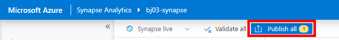

**Module 1: Enterprise Scale for SAP Automation Framework Deployment**

## Scenario 

For this workshop we will be using the Cloud Shell in the portal to
deploy the Control Plane infrastructure. Then, we will be using the
Deployer VM to deploy the remaining infrastructure and the SAP HANA
configurations. There is a customized branch based on the Automation
Framework that will enable us to follow this scenario. This is the
**sap-level-up** branch.

## Introduction

The SAP Automation Deployment Framework is an orchestration tool for
deploying, installing and maintaining SAP environments. It can deploy
the infrastructure as well as install the application. The automation
lab is currently based on SAP HANA 1909. Below we will describe the
general hierarchy and different phases of the deployment. There are
several workflows to deploying the deployment automation, we will be
focusing on one workflow for ease of deployment with a large audience:
**a SAP-HANA standalone environment deployed using bash. [Ensure that
you execute the pre-requisite tasks]{.underline}**

**Environment Overview**

{width="6.3125in" height="4.28125in"}

**[Management Zone:]{.underline}** The management zone houses the
infrastructure from which other environments will be deployed. Once the
management zone is deployed, it rarely needs to be redeployed, if ever.

**Deployer**

This deployment houses the infrastructure that will be needed to deploy
the rest of the infrastructure. It contains the deployer VM, network
infrastructure on which it lives and a key vault with secrets. Deployer
VM has Ansible and Terraform installed and is used to deploy the
remaining Landscape Zone and Workload Zone. A copy of the repository
that you used to deploy the Control Plane will be transferred to the
Deployer machine

**Library**

This deployment consists of the storage accounts for the Terraform state
files as well as the storage account for the SAP bits that will be
deployed to the System deployment.

**[Workload Zone]{.underline}**: The Workload Zone contains the VMs for
the SAP application, including Web VMs, Central Services VMs, and the
HANA database machines. It also deploys the requisite infrastructure
such as the virtual network and the NSGs/Route Table.

**Landscape**

The Landscape contains the Networking for the SAP VMs, including Route
Tables, NSGs, and Virtual Network. The Landscape provides the
opportunity to divide deployments into different environments (Dev,
Test, Prod)

**System**

The system deployment consists of the virtual machines that will be
running the SAP application, including the web, app and database tiers.

  -----------------------------------------------------------------------------------------
  **Step**   **Action Plan**                                **Installation   **Time
                                                            time**           required for
                                                                             each step**
  ---------- ---------------------------------------------- ---------------- --------------
  1          Introduction and Session Walkthrough           NA               10 min

  2          Repository Overview                            NA               5 min

  3          Management Zone Deployment Overview (Deployer  15-30 mins       Prerequisite
             and Library)                                                    

  4          Deploy the Workload Zone Walkthrough           15-30 mins       

  5          System Deployment                               20-30 mins      

  6          Break                                          10 mins          

  7          Talk about naming conventions                  20 mins          

  8          SAP Installation                               60 mins          

  9          SAP Installation Cleanup\[To save the          30 mins          
             credits\]                                                       

                                                                             

                                                                             

                                                                             

                                                                             

                                                                             

                                                                             
  -----------------------------------------------------------------------------------------

# Tasks 0 -- 5 are PRE-REQUISITES to the Level Up

## Task 0: Repository, Downloads and Tooling

The GitHub repository can be found at the link below:

[Azure/sap-hana: Tools to create, monitor and maintain SAP landscapes in
Azure. (github.com)](https://github.com/Azure/sap-hana)'''

Be sure to change the branch from master to **sap-level-up**:

{width="6.268055555555556in"
height="1.3763888888888889in"}

We strongly recommend familiarizing yourself with the documentation
ahead of time to get an idea of how the SAP Automation Framework works.

You will need an SSH client in order to connect to the Deployer. We
recommend using
[**Putty**](https://www.chiark.greenend.org.uk/~sgtatham/putty/latest.html).
Use any SSH client that you feel comfortable with.

Review the Azure Subscription Quota

As part of SAP Level Up, please ensure Microsoft Subscription has a
sufficient Quota of a minimum of 50 for compute sku DDSV4 & EDSV4 in the
assigned region.

  -----------------------------------------------------------------------
  Region Name                                    Region Code
  ---------------------------------------------- ------------------------
  Australia East                                 AUEA

  Canada Central                                 CACE

  Central US                                     CEUS

  East US                                        EAUS

  North Europe                                   NOEU

  South Africa North                             SANO

  Southeast Asia                                 SOEA

  UK South                                       UKSO

  West Europe                                    WEEU

  West US 2                                      WES2
  -----------------------------------------------------------------------

**Let us begin the pre-requisite portion of the lab**

## **Task 1: Cloud Shell Setup**

-   Go to **shell.cloud.com
    (<https://ms.portal.azure.com/#cloudshell/>)**

```{=html}
<!-- -->
```
-   Run the following commands:

> **az login**

Follow the instructions displayed in order to authenticate. You should
see the following screen upon successful authentication:

{width="5.75in" height="4.25in"}

> **az account set -s \<your subscription ID>**
>
> **az account list -o table \| grep True**
>
> Above command helps you to view your subscriptions and [get the
> subscription ID]{.underline} of the one you wish to use.
>
> **mkdir Azure_SAP_Automated_Deployment**
>
> **cd Azure_SAP_Automated_Deployment**
>
> **git clone <https://github.com/Azure/sap-hana.git>**
>
> **cd sap-hana**
>
> **git checkout sap-level-up (ONLY work from this branch during the
> lab)**
>
> {width="5.0in" height="1.78125in"}
>
> cd util
>
> Execute the command **./check_workstation.sh**
>
> {width="5.0in"
> height="0.9270833333333334in"}

-   The below versions are supported for the automation:

> **az = 2.28.0**
>
> **terraform = 1.0.8**
>
> **ansible = 2.10.2**
>
> **jq = 1.5**{width="5.4941447944007in"
> height="1.1145330271216098in"}

If you do not have at least version 0.14.7 for Terraform, please upgrade
using the instructions
[here](https://staticsint.teams.cdn.office.net/evergreen-assets/safelinks/1/atp-safelinks.html?url=https%3A%2F%2Fdocs.microsoft.com%2Fen-us%2Fazure%2Fdeveloper%2Fterraform%2Fget-started-cloud-shell-bash%3Ftabs%3Dbash%233-install-latest-version-of-terraform-in-azure-cloud-shell&locale=en-us&dest=https%3A%2F%2Fteams.microsoft.com%2Fapi%2Fmt%2Fpart%2Fmsft%2Fbeta%2Fatpsafelinks%2Fgeturlreputationsitev2%2F&pc=h5IGXkXPK4uYjva%252foinlhdhyiJfAq1znA%252bGUn4pcjY21Vux%252buUncbgcXJcwiPk77Ib1no%252f0lL1%252beHGFWqMLlI%252bkCwByWZaeZwjm%252fegaAQ5HOXRc5KV2YHXr5D%252fM0Sgjze61HICKwkTPR%252b6p5Lfi8uQO9zE1kMiJp2ekSpqSRlohbmUUX9fk5SGcxRbiUIiD0IiQZ69h%252f3H4nBhww%252fTKaO%252bjljQqBGX96OWQaz5kBv1ZLNruKlicFNKSWVeDJEiQnADTqzafrYyIM%252bjyrlfN4xB3bxULqKN7OhU9vQUgID0YCYYs%252bWI8rpyLviLB2IpMnaWnau4apDScz1n%252fANYdb%252fis5YHvbxDZwQEWL%252b3Rx1sxJk%252fvACR66%252bposC0bMtyHZ55Fv8C6iAceR5kQfasVxcgB5UyLzt2PIo8D4%252fR9fuvdqz9sEH7uFKqUHDkVsWjUuImNUD5PXPlYa619iDChUpM3rvbYuYA87WD7fTNgI8df3MUDqnAWp4n7ITQCV5O6OE0fdhWtBVc4tzRIO1IJVsNo2YDrAoByPNUPNybivCZFE%252fcYWcXWDWYS14XY0EGTIOdjpEU915FWby2ZaAFp28WjIvXA%252bIqoINemcQegLVFK55PH3L7J61qdxlse5IVidfVuYrnc%252bPib4V4BZXH3ki3oFD9Llk1XAO3hLbBN6OtJozDrkdyfrh4qP9WSNUt1eLcMrYMzh94VhPLhe%252b326Yv2xfY8uvFk8%252b%252bzSL%252b5jrTmqPRKLa2Ej1KkKrmpsSnXzGD%252f%252bQHZaKI6mU7tVlNh5hTUKLiuqbD8tmkL2up2GiAaNq3uI9XEO%252fcYmzw50TzUFK4RQ%252frBhKN%252bCtHzYUxchUj%252bHt0SXNX89N8Mrm01idoUpmqv8lPc9qez1aBuv9OjNZAD5pA6a5jceqfKEqqoFNA%253d%253d%3B%20expires%3DFri%2C%2022%20Oct%202021%2021%3A10%3A05%20GMT%3B%20path%3D%2F&wau=https%3A%2F%2Fnam06.safelinks.protection.outlook.com%2FGetUrlReputation&si=https%3A%2F%2Fteams.microsoft.com%2Fmulti-window%2F%3Fagent%3Delectron%26version%3D21092203715&sd=%7BconvId%3A%2019%3Ameeting_Zjg5MzI0YzctYTUwNS00NDgzLWFmYTQtN2ExNGQyM2JhNTcw%40thread.v2%2C%20messageId%3A%201634918084953%7D&ce=prod&cv=27%2F21092203715&ssid=32689ba9-8f5b-2d87-0876-1dcc93b67a72&ring=ring3_9)

## **Task 2: SPN Creation**

**Per Microsoft security guidelines, there will be no screenshots of
this task. Ask your proctor for help if you need assistance with the
following.**

-   The Automation Framework requires the creation of an SPN. Please
    create one in the Cloud Shell using the following commands:

> **When choosing the name for your service principal, ensure that the
> name is [unique within your Azure tenant]{.underline}**
>
> **az ad sp create-for-rbac \--role=\"Contributor\"
> \--scopes=\"/subscriptions/\<Your subscription ID>\"
> \--name=\"LevelUP-SAP-Deployment-\<Your alias>\"**

-   After running this command, you will have output that is populated
    with actual values, like the following:

> **{**
>
> **\"appId\": \"\<AppID>\",**
>
> **\"displayName\": \" \[Yourname\]-Deployment-Account \",**
>
> **\"name\": \"\<AppID>,**
>
> **\"password\": \"\<AppID Secret>\",**
>
> **\"tenant\": \"\<Tenant ID>\"**
>
> **}**

-   Copy the details to a notepad/similar as these details are key for
    the next steps. The pertinent fields are**:**

    -   **appId**

    -   **password**

    -   **Tenant**

> **For your reference, here is the mapping between the output above and
> the parameters that you will need to populate later for the automation
> commands:**

  -----------------------------------------------------------------------
  **Parameter Input name**            **Output from above**
  ----------------------------------- -----------------------------------
  **spn_id**                          **"appId\"**

  **spn_secret**                      **\"password\":**

  **tenant_id**                       **\"tenant\":**
  -----------------------------------------------------------------------

-   Finally, assign the "User Access Administrator" role to the SPN by
    running the following command:

> **az role assignment create \--assignee \<appId> \--role \"User Access
> Administrator\"**

## **Task 3: View Configuration Files and Collect Parameter Values**

**Note that you may have to type this command in manually or paste to
another file editor rather than copy/paste into the VS Code terminal
from this document. Each parameter for the automation commands will
begin with a double dash ("\--"). Ensure that there are no special
characters when typing/pasting in the commands**

-   In the Cloud Shell, type the following commands:

> **cd \~/Azure_SAP_Automated_Deployment**
>
> **cp -Rp ./sap-hana/deploy/samples/WORKSPACES ./**
>
> **Please run "ls" and verify that WORKSPACES folder is available**
>
> {width="5.0in" height="0.71875in"}
>
> **"code ." (Note: There is a period at the end of the command: code
> +** **space + .)**
>
> {width="4.75in" height="5.0in"}

-   Expand the **WORKSPACES** directory -- you will see 5 sub folders:
    **DEPLOYER**, **LANDSCAPE**, **LIBRARY**, **SYSTEM** and **BOMS.**
    Expand each of these folders to find regional deployment
    configuration files similar to the below screenshot:

> {width="5.0in"
> height="2.4166666666666665in"}
>
> **Note: Only use the regional folder associated with your group. Do
> not use the West Europe (WEEU) folders as this is a busy customer
> region.**

-   We have mapped different Azure region with 4-character code (Upper
    Case) and subsequent folders inside WORKSPACES folder has been
    created to represent deployment in those respective regions. Please
    find the below table for reference

  -----------------------------------------------------------------------
  Region Name                                    Region Code
  ---------------------------------------------- ------------------------
  Australia East                                 AUEA

  Canada Central                                 CACE

  Central US                                     CEUS

  East US                                        EAUS

  North Europe                                   NOEU

  South Africa North                             SANO

  Southeast Asia                                 SOEA

  UK South                                       UKSO

  West Europe                                    WEEU

  West US 2                                      WES2
  -----------------------------------------------------------------------

-   If you drill down into each regional sub folder, you will see the
    Terraform variable files that are used for configuration. Snippet of
    the **DEPLOYER** Terraform variable file below.
    {width="5.0in" height="2.4375in"}

-   There are no edits necessary for the Terraform variable files --
    this is informational only so that you can view them and know where
    to make edits for future deployments.

## **Task 4: Export variables and run the prepare_region.sh script**

-   We will use the **prepare_region** script in order to deploy the
    Deployer and Library. These deployment pieces make up the
    "Automation Region"

> **az login**
>
> **Follow the instructions in the Cloud Shell for authenticating**
> **with your normal account, not the service principal you** **created
> earlier**
>
> **az account set --s \<subscription name or ID>**
>
> **export
> DEPLOYMENT_REPO_PATH=\~/Azure_SAP_Automated_Deployment/sap-hana/**
>
> **export ARM_SUBSCRIPTION_ID=\<YOUR SUBSCRIPTION ID>**
>
> {width="5.0in" height="0.40625in"}
>
> Empty output means it has executed as expected. Proceed to next steps

-   Navigate to the **WORKSPACES** folder and deploy the Automation
    Region and run the following commands:

> **cd \~/Azure_SAP_Automated_Deployment/WORKSPACES**
>
> **\${DEPLOYMENT_REPO_PATH}deploy/scripts/prepare_region.sh
> \--deployer_parameter_file
> DEPLOYER/MGMT-\<Region>-DEP00-INFRASTRUCTURE/MGMT-\<Region>-DEP00-INFRASTRUCTURE.tfvars
> \--library_parameter_file
> LIBRARY/MGMT-\<Region>-SAP_LIBRARY/MGMT-\<Region>-SAP_LIBRARY.tfvars
> \--subscription \<subscription ID> \--spn_id \<App ID> \--spn_secret
> \<SPN password> \--tenant_id \<tenant ID> \--auto-approve**
>
> **If you get the following error for the Deployer module deployment,
> ensure that you have navigated to the WORKSPACES directory:**
>
> {width="5.0in"
> height="0.8229166666666666in"}
>
> The Automation will run the Terraform Initialize and Plan operations.
>
> {width="5.0in"
> height="2.15625in"}
>
> This deployer may run between 15 and 20 min.
>
> You should see the progress of the deployment such as below:
>
> {width="5.0in"
> height="2.5104166666666665in"}
>
> The deployment will go through cycles of deploying the infrastructure,
> refreshing the state, and uploading the Terraform state files to the
> Library storage account
>
> **If you get the following error for the Deployer deployment, this is
> transient, and you can simply rerun the exact same command:**
>
> {width="5.020830052493438in"
> height="2.0885323709536308in"}
>
> **If you run into authentication issues directly after running the
> prepare_region script, please execute:**
>
> **az logout**
>
> **az login**
>
> **Also please ensure you are using the correct subscription, the one
> where you created the SPN. If you execute az logout, then you must
> export your session variables again.**

-   When the entire deployment is complete and you see that your
    Terminal has stopped, go to the Azure portal and go to the Deployer
    Infrastructure **(MGMT-\<region>-DEP00-INFRASTRUCTURE)** resource
    group. You should see the following resource types

> Deployer Infrastructure resource group:
>
> {width="5.0in"
> height="1.7708333333333333in"}
>
> LIBRARY resource group (**MGMT-\<region>-SAP_LIBRARY**)
>
> {width="5.0in"
> height="0.6145833333333334in"}
>
> Inside the state file storage account and inside the tfstate
> container, you should see the Deployer and Library state files:
>
> {width="5.0in"
> height="0.5729166666666666in"}

-   Collect the following information in a text editor of your choice.
    We will use these details as parameter inputs for the remainder of
    the commands in Module One:

    -   The name of the Terraform state file storage account in the
        Library resource group. Deployer resource group -\> state
        storage account \> containers -\> tfstate -\> Copy the **name**
        of the Deployer state file

> {width="5.0in" height="2.84375in"}
>
> {width="5.0in"
> height="1.4583333333333333in"}

-   The private ssh secret for the Deployer VM.

> Deployer Resource Group -\> **MGMT\<region>DEP00userXXX -\> \<Key
> Vault> -\>** Click on Secret -\> Click on current version -\> Copy the
> secret
>
> {width="5.0in" height="3.3125in"}
>
> {width="5.0in" height="1.96875in"}
>
> {width="3.8854166666666665in"
> height="5.861334208223972in"}
>
> Open Notepad or a similar editor and paste the contents of the secret
> value. We will use it in the next step.

-   The name of the Deployer resource group key vault

> {width="4.71875in" height="5.0in"}

-   The Public IP address of the Deployer VM

> Deployer resource group -\> Deployer VM -\> copy Public IP Address
>
> {width="6.010415573053368in"
> height="2.8229166666666665in"}

## **Task 5: Connect to the Deployer - The rest of Module One will be completed on the Deployer VM**

**[Ensure that you can connect to your deployer machine as we will be
deploying the rest of the infrastructure from that machine. If you need
assistance, please reach out in the Level Up teams
channel]{.underline}**

-   Open Notepad or and editor of your choice and copy the ssh key
    collected in the previous task. Copy the file to "C:\\Users\\\[your
    alias\]\\.ssh. Name the file "deployer_ssh" and save as the type
    "All Files"

> {width="6.268055555555556in"
> height="0.49930555555555556in"}
>
> **Note: File name should not have .txt extension**
>
> {width="5.0in" height="2.53125in"}

-   **Open PuttyGen (do this by opening a command window and typing
    *puttygen.exe*), then click on "Load"**

> {width="6.268055555555556in"
> height="4.743055555555555in"}

-   **Load the SSH key**{width="6.010416666666667in"
    height="3.609846894138233in"}

-   Save the private the key with name **\<Region>-deployer_ssh**

> {width="6.268055555555556in"
> height="4.854166666666667in"}

-   **Connecting the Deployer VM using PuTTY:**

```{=html}
<!-- -->
```
-   Open Putty

-   Host Name: azureadm@\<Deployer Public IP Address>

-   Connection Name in Saved Sessions:
    > MGMT-**\<Region>**-SSHConnectivity"

> {width="4.055555555555555in"
> height="3.8333333333333335in"}
>
>  

 

-   In the Navigation bar expand "SSH" \--\> Auth setting and add the
    path to the SSH key file browse to "C:\\Users\\\[your
    alias\]\\.ssh\\\<Region>-deployer.ppk" saved

> {width="4.097222222222222in"
> height="3.6744181977252843in"} 

-   Click on Open to open the connection to the Deployer:

> {width="6.268055555555556in"
> height="3.5243055555555554in"}
>
> {width="4.597222222222222in"
> height="2.9027777777777777in"} 

**This completes the pre-requisite portion of the lab. Perform the
remaining tasks in Module One on the Deployer VM**

## **Task 6: Get the WORKSPACES folder and set the branch**

-   Navigate to the **\~/Azure_SAP_Automated_Deployment** folder and
    remove the existing WORKSPACES folder

> **rm -Rf WORKSPACES**

-   Navigate to the **\~/Azure_SAP_Automated_Deployment/sap-hana**
    folder and checkout the sap-level-up branch.

> **git checkout sap-level-up**
>
> {width="5.302325021872266in"
> height="0.8402143482064742in"}

-   Go back to the root deployment folder and copy the repository
    WORKSPACES folder

> **cd \~/Azure_SAP_Automated_Deployment**
>
> **cp -Rp ./sap-hana/deploy/samples/WORKSPACES ./**
>
> {width="5.150949256342957in"
> height="0.9409722222222222in"}

## **Task 7: BOM Details**

The Automation Framework gives you tools to download the SAP Bill Of
Materials (BOM). The downloaded files will be stored in the sapbits
storage account in the SAP Library. The idea is that the sap library
will act as the archive for all sap media requirements for a project.

{width="6.260416666666667in"
height="1.4149398512685913in"}

The BOM itself mimics the SAP maintenance planner in that we have the
relevant product ids and the package download URLs. Once the BOM is
processed, during SAP system configuration the Deployer reads the BOM
and downloads files from the storage account to the SCS Server for
Installation.

A sample extract of a BOM file is provided below:

{width="6.260416666666667in"
height="5.018875765529309in"}

You will be able to utilize the following pre-staged storage accounts
(storage accounts with the SAP binaries) to fill in the
sap-parameters.yaml file. List of storage account details:

  ------------------------------------------------------------------------------------------------------------------------------------------------------------------
  Region      Storage Account     sapbits-location-base-path
  ----------- ------------------- ----------------------------------------------------------------------------------------------------------------------------------
  Australia   mgmtaueasaplib515   [[https://mgmtaueasaplib515.blob.core.windows.net/sapbits]{.underline}](https://mgmtaueasaplib515.blob.core.windows.net/sapbits)
  East                            

  Canada      mgmtcacesaplib3a0   [[https://mgmtcacesaplib3a0.blob.core.windows.net/sapbits]{.underline}](https://mgmtcacesaplib3a0.blob.core.windows.net/sapbits)
  Central                         

  Central US  mgmtceussaplib542   [[https://mgmtceussaplib542.blob.core.windows.net/sapbits]{.underline}](https://mgmtceussaplib542.blob.core.windows.net/sapbits)

  East US     mgmteaussaplib87c   [[https://mgmteaussaplib87c.blob.core.windows.net/sapbits]{.underline}](https://mgmteaussaplib87c.blob.core.windows.net/sapbits)

  North       mgmtnoeusaplib83e   [[https://mgmtnoeusaplib83e.blob.core.windows.net/sapbits]{.underline}](https://mgmtnoeusaplib83e.blob.core.windows.net/sapbits)
  Europe                          

  South       mgmtsanosaplib13c   [[https://mgmtsanosaplib13c.blob.core.windows.net/sapbits]{.underline}](https://mgmtsanosaplib13c.blob.core.windows.net/sapbits)
  Africa                          
  North                           

  SouthEast   mgmtsoeasaplib0c5   [[https://mgmtsoeasaplib0c5.blob.core.windows.net/sapbits]{.underline}](https://mgmtsoeasaplib0c5.blob.core.windows.net/sapbits)
  Asia                            

  UK South    mgmtuksosaplib0b0   [[https://mgmtuksosaplib0b0.blob.core.windows.net/sapbits]{.underline}](https://mgmtuksosaplib0b0.blob.core.windows.net/sapbits)

  West Europe mgmtweeusaplib783   [[https://mgmtweeusaplib783.blob.core.windows.net/sapbits]{.underline}](https://mgmtweeusaplib783.blob.core.windows.net/sapbits)

  West US2    mgmtwus2saplibb32   [[https://mgmtwus2saplibb32.blob.core.windows.net/sapbits]{.underline}](https://mgmtwus2saplibb32.blob.core.windows.net/sapbits)
  ------------------------------------------------------------------------------------------------------------------------------------------------------------------

Navigate to the \~/**Azure_SAP_Automated_Deployment/WORKSPACES/BOMS**
folder and do the following:

> Run **nano sap-parameters.yaml**
>
> {width="5.0in" height="0.5625in"}
>
> Change **\<storage_account_name \_for_sapbit>** to the name of the
> storage account for your region from the table above
>
> Change **\<MGMT KeyVault Name>** to the name of the Deployer resource
> group key vault
>
> On your keyboard enter: **CTRL + X \>** press "**Y" \>** press
> **Enter** to save the file
>
> Your file should look similar to this:
>
> {width="6.260416666666667in"
> height="1.063286307961505in"}
>
> We will provide the SAS token during the Level Up session. We will be
> executing the following commands:
>
> **sapbits_base_path=\<sapbits_location_base_path from sap-parameters
> ile>**
>
> **sas="\<to be given in Level Up>"**
>
> **az keyvault secret set \--name \"sapbits-location-base-path\"
> \--vault-name \"Your_MGMT_KeyVault_Name\" \--value
> \"\$sapbits_base_path\";**
>
> Note: In a previous version o of the doc,"sapbits-location-base-path"
> was highlighted. Don't change anything in string
> \"sapbits-location-base-path\". Use this as-is. Keep vault name in
> """, that is \"Your_MGMT_KeyVault_Name\".
>
> **az keyvault secret set \--name \"sapbits-sas-token\" \--vault-name
> \"Your_MGMT_KeyVault_Name\" \--value \"\$sas\";**

## **Task 8: Deploy the Workload Zone**

-   On the Deployer VM, navigate directly to the regional Workload zone
    folder:

> **cd
> \~/Azure_SAP_Automated_Deployment/WORKSPACES/LANDSCAPE/DEV-\<region>-SAP01-INFRASTRUCTURE**

-   Run the following command. Replace all parameters with the
    appropariate details that you have collected in previous Tasks:

> **\${DEPLOYMENT_REPO_PATH}/deploy/scripts/install_workloadzone.sh
> \--parameterfile ./DEV-\<region>-SAP01-INFRASTRUCTURE.tfvars
> \--deployer_environment MGMT \--subscription \<subscription ID>
> \--spn_id \<SPN App ID> \--spn_secret \<SPN Secret> \--tenant_id
> \<Tenant ID> \--state_subscription \<subscription ID> \--vault
> \<DEPLOYER resource group key vault> \--storageaccountname \<state
> file storage account name> \--deployer_tfstate_key \<name of the
> deployer state file> \--auto-approve**
>
> {width="6.268055555555556in"
> height="3.8833333333333333in"}

-   You should start to see the landscape module deploy:

> {width="6.268055555555556in"
> height="0.9458333333333333in"}

Similarly, once the Landscape is complete, you can deploy the system
resources using the following commands:

-   **cd
    \~/Azure_SAP_Automated_Deployment/WORKSPACES/SYSTEM/DEV-\<region>-SAP01-X00**

```{=html}
<!-- -->
```
-   **\${DEPLOYMENT_REPO_PATH}/deploy/scripts/installer.sh
    \--parameterfile DEV-\<region>-SAP01-X00.tfvars \--type sap_system
    \--auto-approve**

-   You should have two more resource groups

```{=html}
<!-- -->
```
-   Landscape Resource Group example:

> {width="5.593022747156605in"
> height="1.964932195975503in"}

-   System Resource Group (Abridged):\
    {width="6.268055555555556in"
    height="3.6493055555555554in"}

## **Task 9: Naming Conventions**

-   Please see the information on changing the naming convention
    [here](https://github.com/jhajduk-microsoft/sap-hana/blob/master/documentation/SAP_Automation_on_Azure/Process_Documentation/Changing_the_naming_convention.md)

-   Please see the video on naming conventions
    [here](https://microsoft.sharepoint.com/:v:/t/NorthStarPlaybookWorkshop/EfdM1eCJga1OkJXXB5d6lDQBzNzXiU7BZkoQjC6bp325Wg)

Give the break for 10 min and talk about naming convention

## **Task 10: SAP Installation**

For a standalone SAP S/4HANA system we have 8 playbooks to execute in
sequence.

> OS Config
>
> SAP Specific OS Config
>
> BoM processing
>
> HANA DB Install
>
> SCS Install
>
> DB Load
>
> PAS Install
>
> APP Install (Optional)

You need to make sure you have two files generated from earlier SAP
infrastructure provisioning and they are available at
SYSTEM\\DEV-\<region>-SAP01-X00. 

1.  sap-parameters.yaml

2.  X00host.yaml

-   In the sap-parameters.yaml you have to fill bom_base_name parameter
    and modify secret_prefix as below

```{=html}
<!-- -->
```
-   Bom_base_name: S41909SPS03_v0005ms

-   ## kv_name: Name of DEV-\<region>-SAP-INFRASTRUCTURE resource group´s key vault e.g., DEVUKSOSAPuser432** **

-   secret_prefix: DEV-\<region>-SAP (\"region" is four-character region
    code for your deployment). This value is perhaps already populated
    as DEV-\<region>-SAP01; this means remove the "01" at the end.

```{=html}
<!-- -->
```
-   You also have to set the value for sap_fqdn; something like
    foo.sap.com will work fine.

In case you see error like this --

{width="8.180838801399824in"
height="0.3224048556430446in"}

To fix this error, add your Azure user to access policy of key vault in
DEV-\<region>-SAP-INFRASTRUCTURE.

With this, you should be ready to execute the steps 10-1 to 10-8.

Now execute the **\${DEPLOYMENT_REPO_PATH}/deploy/ansible/test_menu.sh**
script

#### **10-1: OS Config**

{width="6.268055555555556in"
height="0.5777777777777777in"}

{width="6.268055555555556in"
height="1.7875in"}

At the end you will see the screen like below

{width="6.268055555555556in"
height="1.8527777777777779in"}

#### **10-2: SAP** Specific OS config

{width="6.268055555555556in"
height="1.4402777777777778in"}

{width="6.268055555555556in"
height="2.3541666666666665in"}

#### **10-3: BoM** Processing

{width="6.268055555555556in"
height="1.2673611111111112in"}

{width="6.268055555555556in"
height="0.4888888888888889in"}

#### **10-4: HANA DB Install**

Before you install HANA please check the secret
DEV-WEEU-SAP-\<SID>-sap-password inside workload keyvault have the value
not starting with a digit

{width="6.268055555555556in"
height="4.18125in"}

So, if the value looks like above i.e starting with a number, we need to
change it.

The password of user DBUser may only consist of alphanumeric characters
and the special characters #, \$, @ and \_. The first character must not
be a digit or an underscore

So it will look like below

{width="6.240454943132108in"
height="6.511325459317585in"}

{width="6.268055555555556in"
height="0.5826388888888889in"}

{width="6.268055555555556in"
height="2.720138888888889in"}

{width="6.268055555555556in"
height="2.1145833333333335in"}

#### **10-5: SCS Install**

{width="6.268055555555556in"
height="2.546527777777778in"}

{width="6.268055555555556in"
height="2.2111111111111112in"}

#### **10-6: DB Load**

{width="6.268055555555556in"
height="1.9506944444444445in"}

{width="6.268055555555556in"
height="2.361111111111111in"}

{width="6.268055555555556in"
height="3.9430555555555555in"}

#### **10-7: PAS** Install

{width="6.268055555555556in"
height="2.1083333333333334in"}

{width="6.268055555555556in"
height="3.0208333333333335in"}

{width="6.268055555555556in"
height="2.191666666666667in"}

#### **10-8: APP Install**

{width="6.268055555555556in"
height="2.1083333333333334in"}

{width="6.268055555555556in"
height="3.421527777777778in"}

{width="6.268055555555556in"
height="2.1729166666666666in"}

Congratulations! You have reached the end of Module One and have
deployed a stand-alone S/4HANA system.

#### **10-9: SAP System Verification**

Now we need to verify the system we have just installed. Please follow
the below steps to check the system status.

Connecting to the corresponding SAP VMs

We can connect to all SAP VMs from deployer VM through SSH. sshkey key
will be available at SYSTEM\\DEV-\<region>-SAP01-X00 folder

**Note:** If you didn't find the sshkey in the above-mentioned folder
then you can copy it from secret DEV-XXXX-SAP-sid-sshkey inside
DEVXXXXSAPuserxxx keyvault.

[Checking HANA services]{.underline}

Login to HANA VM

ssh -i sshkey azureadm@\< DEV-XXXX-SAP01-X00_x00dhdb00l0xxx
\_vm_private_ip>

sudo su - hdbadm

sapcontrol -nr 00 -function GetProcessList

{width="6.268055555555556in"
height="1.770138888888889in"}

All the services status should be green

*Note: 00 here is the instance number of HANA DB*

[Checking SCS Instance]{.underline}

ssh -i sshkey azureadm@\< DEV-XXXX-SAP01-X00_x00scs00lxxx
\_vm_private_ip>

sudo su -- x00adm

sapcontrol -nr 00 -function GetProcessList

{width="6.268055555555556in"
height="1.336111111111111in"}

All the services status should be green

*Note: 00 here is the instance number of SCS Instance*

[Checking PAS Instance]{.underline}

ssh -i sshkey azureadm@\< DEV-XXXX-SAP01-X00_x00app00lxxx_vm_private_ip>

sudo su -- x00adm

sapcontrol -nr 00 -function GetProcessList

{width="6.268055555555556in"
height="1.5645833333333334in"}

All the services status should be green

*Note: 00 here is the instance number of PAS Instance*

[Checking Additional Application Instance]{.underline}

ssh -i sshkey azureadm@\< DEV-XXXX-SAP01-X00_x00app01lxxx_vm_private_ip>

sudo su -- x00adm

sapcontrol -nr 00 -function GetProcessList

{width="6.268055555555556in"
height="1.625in"}

All the services status should be green

*Note: 00 here is the instance number of AAS Instance*

## **Task 11: Clean-up**

You may perform this task outside of the lab but please be sure to do so
as the **[infrastructure can be quite expensive so do not
delay!]{.underline}** You may find that you lose any credits you have
very quickly. Follow the below steps in sequence to remove the entire
SAP infrastructure you have deployed earlier:

Remove SAP Infra Resources -\> Remove Workload Zone -\> Remove Control
Plane

Please also note that

1.  Removal of SAP infra-Resources

2.  Removal of workload Zone

Should be executed from the deployer VM, whereas

3.  Removal of control Plane

Should be executed from cloud shell where you have deployed the control
plane earlier

So, let's start cleaning up Azure resources (for 1 and 2 as mentioned
above) from your Deployer VM

Before you start executing remover script make sure you have logged in
to your Azure account by executing the below command

az login

Authenticate through
<https://login.microsoftonline.com/common/oauth2/authorize>

and enter your device code you see in the bash shell

If you notice multiple subscriptions, please set the specific
subscription you are working with by executing the below command

az account set \--subscription \<your subscription ID>

**Removal of SAP infra resources**

-   Navigate to the DEV-XXXX-SAP01-X00 subfolder inside SYSTEM folder
    and execute the below command from there

> **\$DEPLOYMENT_REPO_PATH/deploy/scripts/remover.sh \--parameterfile
> DEV-\<region>-SAP01-X00.tfvars \--type sap_system**
>
> Proceed with **'yes'**

**Removal of SAP workload resources**

-   Navigate to the DEV-XXXX-SAP01-INFRASTRUCTURE sub-folder inside
    LANDSCAPE folder and execute the below command from there

> **\$DEPLOYMENT_REPO_PATH/deploy/scripts/remover.sh \--parameterfile**
> **DEV-\<region>-SAP01-INFRASTRUCTURE.tfvars \--type sap_landscape**
>
> Proceed with **'yes'**

**Removal of Control Plane**

-   Now go to <https://shell.azure.com> (for 3)

-   Navigate to the WORKSPACES folder inside
    \~/Azure_SAP_Automation_Deployment folder

-   Export the below two environment variables (It get lost after
    session time out)

> **export
> DEPLOYMENT_REPO_PATH=\~/Azure_SAP_Automated_Deployment/sap-hana**
>
> **export ARM_SUBSCRIPTION_ID=\<Your Subscription ID>**

-   and run the below command from WORKSPACES folder:

> **\$DEPLOYMENT_REPO_PATH/deploy/scripts/remove_region.sh
> \--deployer_parameter_file DEPLOYER/MGMT-\<region>-DEP00-**
> **INFRASTRUCTURE/MGMT-\<region>-DEP00-INFRASTRUCTURE.tfvars --**
> **library_parameter_file LIBRARY/MGMT-\<region>-SAP_LIBRARY/
> MGMT-\<region>-SAP_LIBRARY.tfvars**
>
> Proceed with **'yes'**
>
> **Please verify in the Azure portal that all the resource groups are
> now deleted -- if not, delete any remaining resource groups
> manually.**

# Congratulation! You have cleaned up all resources. 

# 

# **Module 2: SAP + Data & AI**

## Scenario 

In the SAP and Data part of the training you\'ll get familiar with basic
tools and methods allowing you to extract and process data stored in the
SAP system outside of the SAP system. You\'ll use the Synapse Pipelines
to copy data to the Azure Data Lake Storage and then import them to
PowerBI to create relationships and visualize them.

## Introduction:

Azure Synapse is the tool for data processing and analytics within
Microsoft cloud. You\'ll use it to extract SAP data using OData protocol
from publicly available SAP system. Below we\'ll describe each step
required to establish the extraction pipeline with the Azure Data Lake
as the target location. Once all data are available you\'ll import them
to PowerBI to create simple data visualization, showing the top
customers.

{width="6.268055555555556in"
height="3.001388888888889in"}

### Agenda

  ---------------------------------------------------------------------------------------
  **S.No**   **Action Plan**                           **Installation   **Time required
                                                       time**           for each step**
  ---------- ----------------------------------------- ---------------- -----------------
  1          Introduction and Session Walkthrough      NA               5 mins

  2          Deploy Synapse Analytics in your          NA               10 mins
             subscription                                               

  3          Prepare Synapse Pipelines resources       NA               20 mins

  4          Create Synapse Pipeline                   NA               10 min

  5          Run and monitor the data extraction         NA             10 mins
             process                                                    

  6          Use parameters to avoid hardcoding values   NA             15 mins

  7          Import extracted data to PowerBI          NA               15 mins

  8          Create relationship between tables and    NA               15 mins
             build simple visual                                        

                                                       Total            100 mins
  ---------------------------------------------------------------------------------------

### 

## **Pre-Requisites**

#### Accessing SAP ES5 system

1.  If you don\'t have an S-User account already you can register using
    the following link:

[Register to access SAP
resources](https://www.sap.com/uk/registration/protected/form-universal-reg.afl.html?generalRegistration=true)

2.  Use the created credentials to register for ES5 Demo system:

[Register to ES5 Demo
system](https://register.sapdevcenter.com/SUPSignForms/)

3.  Once you complete the registration process you should receive e-mail
    containing your credentials to access ES5 system:

{width="6.268055555555556in"
height="2.5881944444444445in"}

4.  Access the SAP WebUI by using the following link:

[Access SAP ES5 system](https://sapes5.sapdevcenter.com/)

5.  Provide your credentials from the e-mail and click Log On. If you
    access the system for the first time you\'ll be prompted to provide
    a new password.

{width="5.729966097987751in"
height="3.5838331146106737in"}

6.  Close the browser. Your access to the demo SAP system is now
    confirmed.

Supporting documentation is available here:

[New SAP Gateway Demo System available \| SAP
Blogs](https://blogs.sap.com/2017/12/05/new-sap-gateway-demo-system-available/)

## 

## **Task 1: Deploy Synapse Analytics in your subscription**

#### Deploy Synapse Analytics Workspace

-   Ensure the Synapse provider is registered in your subscription. Go
    to your subscriptions in the Azure Portal and go to Resource
    Providers, then search for Synapse and ensure it is a registered
    provider:

> {width="5.0in"
> height="3.3854166666666665in"}

-   Open Azure Portal (<https://portal.azure.com>) and type Synapse
    Analytics in the top search box. Open the Azure Synapse Analytics
    blade.

{width="4.958333333333333in"
height="1.0520833333333333in"}

-   Click Create Synapse workspace button

> {width="5.0in"
> height="4.65625in"}

-   Choose and provide the resource group and workspace names together
    with account and file system names for the Data Lake Storage. Ensure
    the checkbox \"Assign myself the Storage Blob Data Contributor role
    on the Data Lake storage...\" is marked.

You don\'t have to provide the name for Managed resource group.

> {width="5.385416666666667in"
> height="5.852598425196851in"}

-   Click on Review + Create button to go to summary page

{width="4.135416666666667in"
height="0.4869892825896763in"}

-   Click Create button at the bottom on the page to confirm the
    deployment. It will take a couple of minutes to deploy the service.

## **Task 2:** Prepare Synapse Pipelines resources

In this task you\'ll access your Synapse workspace and you\'ll deploy
basic resources required to establish data extraction using OData
protocol.

#### Step 1: Access Synapse Studio 

To access Synapse Studio open Azure Portal (<https://portal.azure.com>)
and go to Azure Synapse Analytics. Then choose Open Synapse Studio.

{width="6.268055555555556in"
height="3.689583333333333in"}

#### Step 2 -- Create a Linked Service to connect to SAP system

1)  On the left menu choose Manage icon

{width="4.177666229221347in"
height="3.8859590988626422in"}

2)  Select Linked Services from the menu

{width="4.573555336832896in"
height="3.9901399825021873in"}

3)  Click +New button

{width="6.268055555555556in"
height="2.5840277777777776in"}

4)  On the New Linked Service blade set the type to OData

{width="6.268055555555556in"
height="3.222916666666667in"}

5)  Fill the required fields to establish a connection:

**Name:** ES5_OData

**Connect via Integration Runtime:** AutoResolveIntegrationRuntime

**Service URL:**
<https://sapes5.sapdevcenter.com/sap/opu/odata/sap/SEPMRA_SO_MAN>

**Authentication type:** Basic authentication

**Username:** \<ES5 demo system username>

**Password:** \<ES5 demo system password>

Auth headers:

Property name: sap-client

Value: 002

{width="3.942227690288714in"
height="4.78125in"}

6)  Click Test Connection button. You should receive confirmation
    \"Connection Successful\"

{width="6.268055555555556in"
height="0.7347222222222223in"}

7)  Click Create to save your settings.

#### STEP 3 -- Create Integration Dataset that represents the OData

1)  On the left menu choose Data icon

{width="4.177666229221347in"
height="3.8859590988626422in"}

2)  Switch the view from Workspace to Linked

{width="3.40625in"
height="1.6492432195975504in"}

3)  Click the + button and create a new Integration Dataset

{width="6.268055555555556in"
height="3.0881944444444445in"}

4)  On the New Integration Dataset blade set the type to OData

5)  Set Integration Dataset properties:

**Name**: ES5_OData_Dataset

**Linked Service**: \<choose previously created Linked Service>

**Path**: Choose SEPMRA_C\_SalesOrder from the list

{width="6.268055555555556in"
height="3.0625in"}

6)  Click OK to save your settings

#### STEP 4 -- Create Integration Dataset that represents the target Data Lake

Together with the Synapse Analytics you also deployed a data lake
storage which we will use as the target location for extracted SAP data.

1)  On the left menu choose Data icon

2)  Switch the view from Workspace to Linked

{width="3.40625in"
height="1.6492432195975504in"}

3)  Click the + button and create a new Integration Dataset

{width="6.268055555555556in"
height="3.0881944444444445in"}

4)  On the New Integration Dataset blade set the type to Azure Data Lake
    Storage Gen2 and click Continue

{width="6.268055555555556in"
height="6.025in"}

5)  Set the file format to Parquet

{width="4.291666666666667in"
height="4.516092519685039in"}

6)  Provide the name of the Integration Dataset and link it to the Data
    Lake storage that was created as part of Synapse

**Name:** ES5_DataLake

**Linked Service:** \<choose the linked service pointing to Data Lake -
\*WorkspaceDefaultStorage

In the File Path section provide the Synapse filesystem created during
service provisioning. You can either provide the name directly in the
file system name, or use the Folder icon to select it using the user
interface. Leave the directory and file name empty.

{width="4.510416666666667in"
height="2.394128390201225in"}

7)  Click OK to save your settings

#### STEP 5 -- Publish and save your settings.

To save and deploy changes made to Synapse workspace you need to click
the button Publish All.

{width="6.268055555555556in"
height="0.75in"}

All changes made in Synapse are now saved.

## **Task 3: Create Synapse Pipeline**

In the previous task we created all required resources to establish the
connection with the source system and target storage. In this task
we\'ll use them to build the data extraction pipeline.

#### STEP 1 -- Create a new pipeline

1)  From the left menu choose Integrate icon

{width="4.177666229221347in"
height="3.8859590988626422in"}

2)  Click the + button and select Pipeline

{width="6.268055555555556in"
height="2.9208333333333334in"}

3)  In the Properties window on the right side of the screen provide the
    name of the pipeline:

**Name:** ES5_Pipeline

{width="5.0in"
height="1.6770833333333333in"}

#### STEP 2 -- Add Copy Data activity to extract Sales Orders

To extract Sales Orders data from the source SAP system you will use the
copy data activity.

1)  On the Activities menu expand the Move and Transform group

{width="6.268055555555556in"
height="2.1909722222222223in"}

2)  Move the Copy Data activity to the pipeline

{width="6.268055555555556in"
height="1.85in"}

3)  Click on the Copy Data activity on the pipeline. Provide the name of
    the activity under the General tab:

**Name**: ES5_CopyData

{width="6.268055555555556in"
height="2.3555555555555556in"}

4)  Move to the Source tab and choose the source dataset that represents
    the OData connection to the ES5 system

{width="6.268055555555556in"
height="1.8166666666666667in"}

5)  Move to the Sink tab and choose the target dataset that represents
    the Data Lake storage:

{width="6.268055555555556in"
height="1.50625in"}

6)  Click Publish All to save your settings

The data extraction pipeline is now created.

## **Task 4:** Run and monitor the data extraction process

In the last task we created a pipeline containing the Copy Data activity
to extract SAP data to the lake. Now we will run it to verify everything
went well.

#### STEP 1 -- Run the extraction pipeline

1)  Ensure you clicked the Publish All button and all settings are saved

2)  On the Pipeline screen click the Add Trigger button and select Now
    to start the processing immediately

{width="6.268055555555556in"
height="2.067361111111111in"}

3)  Confirm by clicking OK button. The extraction is now started.

#### 

#### STEP 2 -- Check the processing status

1)  On the left menu choose the Monitor button

{width="4.177666229221347in"
height="3.8859590988626422in"}

2)  In the Pipeline Runs view you should see the current status of the
    extraction process

{width="6.268055555555556in"
height="1.8111111111111111in"}

3)  The extraction will take around one or two minutes. Use the Refresh
    button to see the current status of the extraction.

4)  Once the Status is changed to Successful click on the pipeline name.
    In this view you can see the status of each activity contained in
    the pipeline.

{width="6.268055555555556in"
height="1.8111111111111111in"}

5)  In the Activity Runs section select the copy data activity and
    choose the Glasses icon to see the activity details.

{width="6.268055555555556in"
height="2.957638888888889in"}

6)  The details of the Copy Data contain useful information about the
    extraction process, like the total duration or number of rows
    processed.

{width="6.268055555555556in"
height="4.978472222222222in"}

7)  Click X button to close the Details window.

#### STEP 2 -- Display extracted data in Synapse

Once we have all data available in the Data Lake you can use Synapse to
display the data.

1)  Choose the Data icon from the left menu and switch to the Linked
    view

{width="5.479931102362205in"
height="3.427561242344707in"}

2)  Expand the Azure Data Lake Storage Gen2 group and then expand the
    Data Lake storage group. Choose the Synapse filesystem:

{width="6.1779451006124235in"
height="3.4692344706911635in"}

3)  You should see a list of files stored in the container

{width="6.268055555555556in"
height="1.5263888888888888in"}

4)  Click on the file using the right mouse button and choose New SQL
    Script -- Select TOP 100 Rows

{width="6.268055555555556in"
height="3.2131944444444445in"}

5)  Click the Run icon

{width="6.268055555555556in"
height="1.1555555555555554in"}

6)  Extracted data are displayed on the screen

{width="6.268055555555556in"
height="1.9041666666666666in"}

7)  Delete the file containing data extraction -- we will run the
    process again.

{width="6.268055555555556in"
height="0.7826388888888889in"}

The extraction pipeline run successfully and you were able to display
the content of the file stored in the data lake.

## **Task 5:** Use parameters to avoid hardcoding values

So far all values in were hardcoded, which mean that if you\'d like to
extract any additional data you have to create another Integration. In
the Copy Data activity we\'ll define a parameter that represents the
OData entity name we\'d like to process. This way we will avoid creating
additional resources if we want to extract more than one entity from a
single OData service.

#### STEP 1 -- Define parameters for the OData dataset

1)  Select Data from the left menu, expand available Integration
    Datasets and select the OData one.

{width="6.21961832895888in"
height="2.979582239720035in"}

2)  Go to the Parameters tab and choose the +New button

{width="6.268055555555556in"
height="1.9159722222222222in"}

3)  Create a new parameter EntityName of type String. Leave the default
    value empty

{width="6.268055555555556in"
height="2.576388888888889in"}

4)  Go to the Connection tab and check the Edit checkbox under the Path
    input box

> {width="6.268055555555556in"
> height="1.5854166666666667in"}

5)  Clear the details from the Path text box . Choose Add Dynamic
    Content

> {width="6.268055555555556in"
> height="1.7236111111111112in"}

6)  We will use Expressions to get the value of the EntityName to
    process. In the Add Dynamic Content view expand the Parameters group
    and choose EntityName:

{width="6.2672101924759405in"
height="4.82708552055993in"}

7)  Click OK to save your settings.

#### STEP 2 -- Define parameters for the Data Lake dataset

1)  Open the Integration Dataset that represent the target data lake

{width="6.1779451006124235in"
height="3.3754713473315836in"}

2)  Go to the Parameters tab and choose the +New button

{width="6.268055555555556in"
height="2.076388888888889in"}

3)  Create a new parameter Path of type String. Leave the default value
    empty

{width="6.268055555555556in"
height="2.5840277777777776in"}

4)  Go to the Connection tab

5)  Click on the Directory field under File path and choose Add Dynamic
    Content

> {width="6.268055555555556in"
> height="2.2506944444444446in"}

6)  As in the previous step we will use the expression to reference the
    newly defined parameter.

{width="6.268055555555556in"
height="2.267361111111111in"}

7)  Click OK to save your settings.

#### STEP 3 -- Modify existing Copy Data activity to pass parameters

1)  Choose Integrate from the left menu. Open the existing pipeline and
    select the Copy Data activity

2)  In the Source tab you\'ll notice a new EntityName field. Enter a
    value SEPMRA_C\_SalesOrder

{width="6.268055555555556in"
height="3.225in"}

3)  Open the Sink tab. You\'ll notice a new Path field. Enter the
    SEPMRA_C\_SalesOrder value.

{width="6.268055555555556in"
height="2.8965277777777776in"}

With above changes data extracted from the SEPMRA_C\_SalesOrder entity
of the OData service will land in a directory and not in the root
filesystem.

#### STEP 4 -- Add a new Copy Data activity to extract customer information

1)  Choose Integrate from the left menu. Open the existing pipeline.

2)  Add a new Copy Activity to the same pipeline and provide the name

**Name:** ES5_CopyData_Cust

{width="6.268055555555556in"
height="1.5041666666666667in"}

3)  In the source tab reference the OData integration dataset. This time
    provide another Entity name: SEPMRA_C\_SalesOrderCustomer

{width="6.268055555555556in"
height="2.973611111111111in"}

4)  In the Sink tab reference the target Data Lake storage. Provide
    SEPMRA_C\_SalesOrderCustomer as the Path parameter.

{width="6.268055555555556in"
height="2.973611111111111in"}

#### STEP 5 -- Run and monitor the extraction

By using parameters we gained the possibility to customize integration
datasets during runtime, which allows us to reuse the resources to
process multiple objects. All extracted data from both entities will now
land in separate directories.

1)  Ensure you clicked the Publish All button to save your settings.

2)  Click Add Trigger -\> Now button

3)  Move to the Monitor view and wait until the extraction is completed

4)  When you display the Activity Runs you see both activities were
    completed successfully:

> {width="6.268055555555556in"
> height="1.4479166666666667in"}

5)  Go back to the Data view and display the content of the data lake.
    This time the target files are stored in subdirectories instead of
    the root folder.

{width="6.268055555555556in"
height="1.5506944444444444in"}

6)  Ensure there are files in both directories. Display the content of
    both files.

## **Task 6: Import extracted data to PowerBI** 

Once we have all data stored in the Data Lake we can import them to
PowerBI.

#### STEP 1 -- Get Data Lake account key

1)  Login to Azure Portal and go to storage accounts

2)  Open the Storage Account that was created during Synapse Workspace
    deployment

> {width="6.268055555555556in"
> height="2.5166666666666666in"}

3)  Copy the Account Key which will be required to establish
    connectivity

{width="6.268055555555556in"
height="3.7881944444444446in"}

#### STEP 2 -- Import your data to PowerBI

1)  Open PowerBI Desktop

2)  Click the Get Data button from the top menu

{width="6.268055555555556in"
height="0.8583333333333333in"}

3)  Choose the Data Lake as the source service and click connect

{width="6.230036089238845in"
height="2.2919860017497813in"}

4)  Provide the URL of the Data Lake service together with the file
    system and directory name with Sales Order data. The URL should look
    as follow:

https://\<nameOfADLS>.dfs.core.windows.net/synapse/SEPMRA_C\_SalesOrder

{width="6.268055555555556in"
height="2.220138888888889in"}

5)  Provide the previously copied Account Key and click Connect

{width="6.268055555555556in"
height="2.3847222222222224in"}

6)  Click Transform Data to import Sales Order data to PowerBI. If you
    see more than one file here it means you haven\'t provided the full
    path to the file (the directory is missing)

{width="6.268055555555556in"
height="2.8381944444444445in"}

7)  The file metadata information have been loaded to PowerBI as a
    table. As we\'re interested in the content of the file you have to
    expose this information to PowerBI. In the table view, in the first
    column click the Binary button

{width="6.268055555555556in"
height="1.4534722222222223in"}

8)  Now all extracted rows are displayed on the screen. On the right
    hand side provide the name of the query:

Name: SalesOrders

{width="6.268055555555556in"
height="1.2409722222222221in"}

9)  Choose Apply and Close to finish importing data to PowerBI

{width="6.268055555555556in"
height="1.8840277777777779in"}

10) Sales Orders have been loaded to PowerBI.

11) Repeat steps 2-10 to load customer information.

> Path: https://
> \<nameOfADLS>.dfs.core.windows.net/synapse/SEPMRA_C\_SalesOrderCustomer/
>
> Query name: Customers

12) Verify that in the Fields list you can see both Customers and
    SalesOrders tables

{width="6.268055555555556in"
height="2.4583333333333335in"}

## **Task 7: Create relationship between tables and build a simple visual** 

All extracted data are available in PowerBI. In this task you\'ll set
relationship between Customer and SalesOrders tables and visualize the
data.

#### STEP 1 -- Create relationship between tables

1)  On the left menu of PowerBI choose Model icon

{width="6.268055555555556in"
height="2.4583333333333335in"}

2)  Choose manage relationship from the top menu

{width="6.268055555555556in"
height="2.560416666666667in"}

3)  In the pop up window choose New

{width="6.268055555555556in"
height="4.415972222222222in"}

4)  In the new window choose Customers as the first table and Sales
    Orders as the second

{width="6.268055555555556in"
height="3.7694444444444444in"}

5)  From the list of columns under Customer table mark the Customer
    column. This is the primary key.

{width="6.268055555555556in"
height="1.511111111111111in"}

6)  From the list of columns under SalesOrders table mark the SoldTo
    column. You may need to use the scroll bar to move to the right.
    This is the foreign key.

{width="6.268055555555556in"
height="1.4333333333333333in"}

7)  Don\'t make any other changes in the window. Click OK to create the
    relationship.

8)  In the Manage Relationship you should see the relationship you have
    just created. Verify the Active box is checked. Click Close.

{width="6.268055555555556in"
height="4.4215277777777775in"}

9)  You should notice that the Model view is updated and you can see the
    relationship between tables. Click on the Report icon from the left
    menu.

{width="6.268055555555556in"
height="2.1125in"}

#### STEP 2 -- Create data visualization

1)  On the Report view of PowerBI expand the Visualizations menu on the
    right. Choose Pie Chart from the list.

{width="6.268055555555556in"
height="2.4763888888888888in"}

2)  A new char was added to the screen. Expand the SalesOrders tables
    and mark the checkbox next to field NetAmountInTransactionCurrency.
    You\'ll notice this field is now displayed in the Values:

{width="6.268055555555556in"
height="2.411111111111111in"}

3)  Expand the Customers tables and mark the CustomerName checkbox.
    You\'ll notice this field is now displayed in the Legend section:

{width="6.268055555555556in"
height="2.411111111111111in"}

4)  Enlarge the chart. It displays information total sales order value
    per customer.

{width="6.268055555555556in"
height="3.573611111111111in"}

#### STEP 2 -- Use filtering in PowerBI

Charts in PowerBI can interact with each other. Filter selected on one
visual is automatically applied to the other one. In this task you\'ll
see how to display sales value over time for selected customer.

1)  Add Line Chart to the report from the Visualization view

{width="6.268055555555556in"
height="1.7361111111111112in"}

2)  Expand SalesOrder table and select checkbox next to
    NetAmountInTransactionCurrency. You\'ll notice it\'s now part of the
    Values group in the Visualization:

{width="6.268055555555556in"
height="2.0868055555555554in"}

3)  Select the checkbox next to CreationDateTime field. It\'s now part
    of the Axis group of the Visualization:

{width="6.268055555555556in"
height="2.0868055555555554in"}

4)  The Line Chart now displays sales value over time for all customers.

{width="5.719548337707787in"
height="2.260731627296588in"}

5)  On the Pie Chart select the Sorali customer from the List. You\'ve
    just set data filter which applies to all visuals on the report. The
    Line Chart now display sales value only for the Sorali customer.

{width="5.761220472440945in"
height="4.875680227471566in"}

6)  Click on the customer name again to undo the filtering.

#### STEP 3 -- Use forecasting with PowerBI

PowerBI contains AI features that allow to prepare data forecasting. In
below example you\'ll forecast sales volume based on past data.

1)  Select the created Line Chart on the screen.

2)  In the Axis field click the X next to Quarter to remove it from the
    Hierarchy

{width="6.268055555555556in"
height="2.298611111111111in"}

3)  On the Line Chart click the down arrow to enable drill down
    functionality

{width="5.771639326334208in"
height="2.50034886264217in"}

4)  Click the data point for 2021 to drill down into months:

{width="5.771639326334208in"
height="2.50034886264217in"}

5)  The Line Chart now displays only data for 2021:

{width="5.709130577427821in"
height="2.271150481189851in"}

6)  While the Line Chart is selected go to Analytics view in the
    Visualizations:

{width="2.6462029746281717in"
height="4.844425853018373in"}

7)  Expand the Forecast group and click Add.

{width="2.635784120734908in"
height="3.875541338582677in"}

8)  Change the Forecast Length to 2 Points and click Apply

{width="2.635784120734908in"
height="3.708850612423447in"}

9)  The line chart now displays all existing data points of the year
    2021 as well as forecast for next two months:

{width="5.75080271216098in"
height="2.3024048556430445in"}

10) Move your mouse over the Nov 2021 data point to display the
    forecasting values:

{width="6.268055555555556in"
height="2.097916666666667in"}

You\'ve created a simple forecast in PowerBI

# **Summary**

Lessons learned; topics covered
